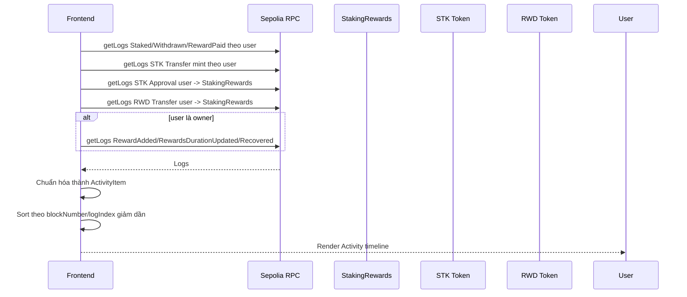

# Guide triển khai Activity / Transaction History

## 1. Mục tiêu

Mục tiêu của phần mở rộng này là bổ sung một màn lịch sử hoạt động cho frontend `Staking Core`, giúp người dùng xem lại các thao tác đã thực hiện với staking app trên Sepolia.

Màn Activity sẽ tập trung vào dữ liệu thực tế từ on-chain logs, không chỉ lưu lịch sử tạm trong trình duyệt. Người dùng có thể thấy các hoạt động như:

```text
Mint STK -> Approve STK -> Stake STK -> Unstake STK -> Claim RWD
```

Đối với owner/admin, màn Activity cũng có thể hiển thị thêm các hoạt động quản trị như:

```text
Fund reward pool -> Notify reward amount -> Update reward duration -> Recover token
```

## 2. Thực tế hiện tại của project

Frontend hiện tại đã có:

| Thành phần | Trạng thái |
|---|---|
| Kết nối ví injected EIP-1193 | Đã có |
| Switch Sepolia | Đã có |
| Đọc state staking bằng `viem` | Đã có |
| Gửi transaction bằng `viem` wallet client | Đã có |
| Dashboard / Rewards / Admin | Đã có |
| Transaction panel / overlay | Đã có |
| Faucet STK testnet | Đã có |
| Onboarding checklist | Đã có |

Các contract đang dùng trên Sepolia:

| Contract | Địa chỉ |
|---|---|
| `StakingRewards` | `0x8B30864bEF5B75C39D19Af249D6bbC4210B55963` |
| `StakingToken` / `STK` | `0x69F9e365D78dCB684DDe29ea6A05854273917db8` |
| `RewardsToken` / `RWD` | `0x20bF1B78E8B13B3273a27979725Faf1B74902e07` |

Block deploy đã ghi nhận:

| Contract | Block |
|---|---|
| `StakingToken` | `11001025` |
| `RewardsToken` | `11001025` |
| `StakingRewards` | `11001030` |

Vì các contract được deploy ở block cụ thể, Activity History nên bắt đầu đọc log từ block `11001025` để tránh quét toàn bộ Sepolia.

## 3. Event có thể dùng

### 3.1 Event từ `StakingRewards`

Contract `StakingRewards` hiện có các event:

```solidity
event Staked(address indexed user, uint256 amount);
event Withdrawn(address indexed user, uint256 amount);
event RewardAdded(uint256 reward);
event RewardPaid(address indexed user, uint256 reward);
event RewardsDurationUpdated(uint256 newDuration);
event Recovered(address indexed token, uint256 amount);
```

Ý nghĩa cho Activity:

| Event | Hiển thị |
|---|---|
| `Staked(user, amount)` | User stake `STK`. |
| `Withdrawn(user, amount)` | User unstake `STK`. |
| `RewardPaid(user, reward)` | User claim `RWD`. |
| `RewardAdded(reward)` | Owner notify reward amount. |
| `RewardsDurationUpdated(newDuration)` | Owner cập nhật reward duration. |
| `Recovered(token, amount)` | Owner recover token gửi nhầm. |

### 3.2 Event từ ERC20 `STK` và `RWD`

`MockERC20` kế thừa ERC20 chuẩn nên có event:

```solidity
event Transfer(address indexed from, address indexed to, uint256 value);
event Approval(address indexed owner, address indexed spender, uint256 value);
```

Ý nghĩa cho Activity:

| Event | Điều kiện lọc | Hiển thị |
|---|---|---|
| `Transfer` của `STK` | `from == 0x0`, `to == user` | Mint STK từ Faucet. |
| `Approval` của `STK` | `owner == user`, `spender == StakingRewards` | Approve STK cho staking contract. |
| `Transfer` của `RWD` | `from == user`, `to == StakingRewards` | Fund reward pool. |

Lưu ý: một số event ERC20 cũng xuất hiện như side effect của stake/unstake/claim. Để màn Activity dễ hiểu, nên ưu tiên event nghiệp vụ từ `StakingRewards` cho stake, unstake và claim, còn ERC20 dùng cho mint faucet, approve và fund reward pool.

## 4. Phạm vi triển khai

Phạm vi nên triển khai trước:

| Hạng mục | Mô tả |
|---|---|
| Thêm màn `Activity` | Bổ sung navigation item mới cạnh Dashboard/Rewards/Admin. |
| Đọc on-chain logs | Dùng `publicClient.getLogs` từ `viem`. |
| Hiển thị lịch sử theo ví | User chỉ thấy activity liên quan tới ví đang kết nối. |
| Hiển thị admin activity | Nếu ví là owner thì hiển thị thêm event quản trị. |
| Link Etherscan | Mỗi activity có link transaction hash. |
| Manual refresh | Dùng lại nút refresh hiện có hoặc thêm nút reload riêng trong panel. |
| Empty/loading/error state | Có trạng thái rõ ràng khi chưa có activity hoặc RPC lỗi. |
| Responsive layout | Hoạt động tốt trên desktop và mobile web. |
| RPC fallback | Dùng nhiều Sepolia RPC endpoint để tránh lỗi public RPC tạm thời. |

Không triển khai trong bước đầu:

| Không làm ngay | Lý do |
|---|---|
| Backend indexer riêng | Project hiện là frontend trực tiếp với Sepolia, chưa cần backend. |
| Database lưu history | On-chain log đủ cho phạm vi capstone. |
| Phân trang server-side | Lượng event testnet của project còn nhỏ. |
| Multi-chain history | Project đang cố định Sepolia. |

## 5. Thiết kế dữ liệu frontend

Nên tạo kiểu dữ liệu nội bộ:

```ts
type ActivityItem = {
  id: string;
  type:
    | "mint"
    | "approve"
    | "stake"
    | "unstake"
    | "claim"
    | "fund"
    | "notify"
    | "duration"
    | "recover";
  title: string;
  description: string;
  amount?: bigint;
  token?: "STK" | "RWD";
  hash: Hash;
  blockNumber: bigint;
  logIndex: number;
};
```

Có thể bổ sung `timestamp` sau bằng cách đọc block theo `blockNumber`. Tuy nhiên để tránh gọi quá nhiều RPC, bước đầu có thể hiển thị block number và link Etherscan. Nếu cần thời gian thật, có thể cache block timestamp theo block number.

## 6. Luồng đọc activity

Luồng tổng quát:



Khi triển khai thực tế, không nên gọi tất cả nhóm log song song. Public RPC trên Sepolia có thể giới hạn block range hoặc rate limit. Cách ổn định hơn là:

| Kỹ thuật | Giá trị |
|---|---|
| Chia block range | Đọc từ block deploy theo từng chunk nhỏ. |
| Đọc tuần tự | Tránh gửi quá nhiều `eth_getLogs` cùng lúc. |
| Retry nhẹ | Thử lại khi một chunk bị lỗi tạm thời. |
| Fallback RPC | Tự chuyển endpoint nếu RPC chính lỗi. |
| Partial result | Nếu một nhóm log lỗi, vẫn hiển thị các nhóm log đã đọc được. |

## 7. Lọc log đề xuất

### 7.1 User staking activity

Đọc từ `StakingRewards`:

| Activity | Event | Filter |
|---|---|---|
| Stake | `Staked` | `user = connected address` |
| Unstake | `Withdrawn` | `user = connected address` |
| Claim | `RewardPaid` | `user = connected address` |

### 7.2 Faucet và allowance

Đọc từ `StakingToken`:

| Activity | Event | Filter |
|---|---|---|
| Mint STK | `Transfer` | `from = zeroAddress`, `to = connected address` |
| Approve STK | `Approval` | `owner = connected address`, `spender = StakingRewards` |

### 7.3 Reward pool funding

Đọc từ `RewardsToken`:

| Activity | Event | Filter |
|---|---|---|
| Fund reward pool | `Transfer` | `from = connected address`, `to = StakingRewards` |

### 7.4 Admin activity

Nếu `connected address == owner`, đọc thêm từ `StakingRewards`:

| Activity | Event | Filter |
|---|---|---|
| Notify reward | `RewardAdded` | Không có indexed param. |
| Update duration | `RewardsDurationUpdated` | Không có indexed param. |
| Recover token | `Recovered` | Không cần filter hoặc filter theo token nếu muốn. |

## 8. UI đề xuất

Thêm view mới:

```text
Dashboard | Rewards | Activity | Admin
```

Màn `Activity` gồm:

| Thành phần | Nội dung |
|---|---|
| Page heading | Tiêu đề `Activity History`, mô tả ngắn theo ví đang kết nối. |
| Summary row | Tổng số activity, block bắt đầu đọc, network Sepolia. |
| Filter chips | All, Wallet, Admin nếu cần. |
| Activity timeline/list | Mỗi item có icon, title, amount, block, tx hash link. |
| Empty state | Khi ví chưa có hoạt động. |
| Error state | Khi RPC trả lỗi. |

Mỗi item nên hiển thị:

```text
Stake STK
10 STK deposited into StakingRewards
Block 11001234 · 0xabc...123
```

## 9. Trạng thái cần xử lý

| State | Cách xử lý |
|---|---|
| Chưa connect wallet | Dùng empty state kết nối ví hiện có. |
| Sai network | Dùng wrong network state hiện có. |
| Đang load logs | Hiển thị loading row trong Activity panel. |
| Không có logs | Hiển thị empty message nhẹ nhàng. |
| RPC lỗi | Hiển thị inline error trong panel. |
| Có transaction mới | Sau khi transaction success, gọi lại `loadActivity()`. |

## 10. Kiểm thử cần chạy

Sau khi triển khai cần kiểm tra:

```text
npm run build
npm audit --audit-level=moderate
```

Kiểm tra dev server:

```text
http://127.0.0.1:5173/
```

Kiểm thử thủ công:

| Case | Kết quả mong đợi |
|---|---|
| Connect ví đã từng stake | Activity hiển thị stake/claim/approve/mint nếu có. |
| Mint STK mới | Sau transaction success, Activity có item Mint STK. |
| Approve STK | Activity có item Approve STK. |
| Stake STK | Activity có item Stake STK. |
| Unstake STK | Activity có item Unstake STK. |
| Claim RWD | Activity có item Claim RWD. |
| Owner fund/notify reward | Owner thấy item admin tương ứng. |
| Mobile viewport | List không tràn, tx hash/link vẫn bấm được. |

## 11. Giới hạn kỹ thuật

| Giới hạn | Ghi chú |
|---|---|
| Phụ thuộc public RPC | Nếu RPC chặn hoặc giới hạn `getLogs`, cần đổi RPC provider. |
| Không có timestamp nếu chưa đọc block | Bước đầu có thể dùng block number để giảm số RPC call. |
| Event admin không có indexed owner | Chỉ hiển thị admin event khi connected wallet là owner. |
| Không có backend indexer | Lịch sử được đọc trực tiếp từ chain mỗi lần load. |
| Lịch sử chỉ thuộc contract capstone | Không phải toàn bộ lịch sử ví trên Sepolia. |

## 12. Hướng mở rộng sau này

Sau khi Activity cơ bản chạy ổn, có thể mở rộng:

| Hướng mở rộng | Giá trị |
|---|---|
| Cache block timestamp | Hiển thị ngày giờ thật cho từng activity. |
| Filter theo loại activity | Dễ xem stake/claim/admin riêng. |
| Export CSV | Hữu ích cho báo cáo hoặc demo. |
| Event analytics | Tổng stake/claim/faucet theo ví. |
| Backend indexer | Phù hợp nếu app public nhiều người dùng. |

## 13. Kết luận

Activity / Transaction History là bước mở rộng phù hợp sau Faucet vì giúp ứng dụng không chỉ thao tác được với contract mà còn theo dõi được quá trình sử dụng. Cách triển khai nên bám sát dữ liệu on-chain từ Sepolia, tận dụng event hiện có, không cần deploy thêm contract và không cần backend ở giai đoạn đầu.

Phạm vi triển khai đề xuất là thêm một màn `Activity` trong frontend, đọc logs bằng `viem`, chuẩn hóa thành danh sách hoạt động dễ hiểu, có link Etherscan và hoạt động tốt trên cả desktop lẫn mobile web.
