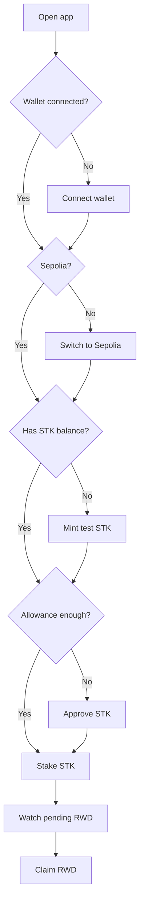
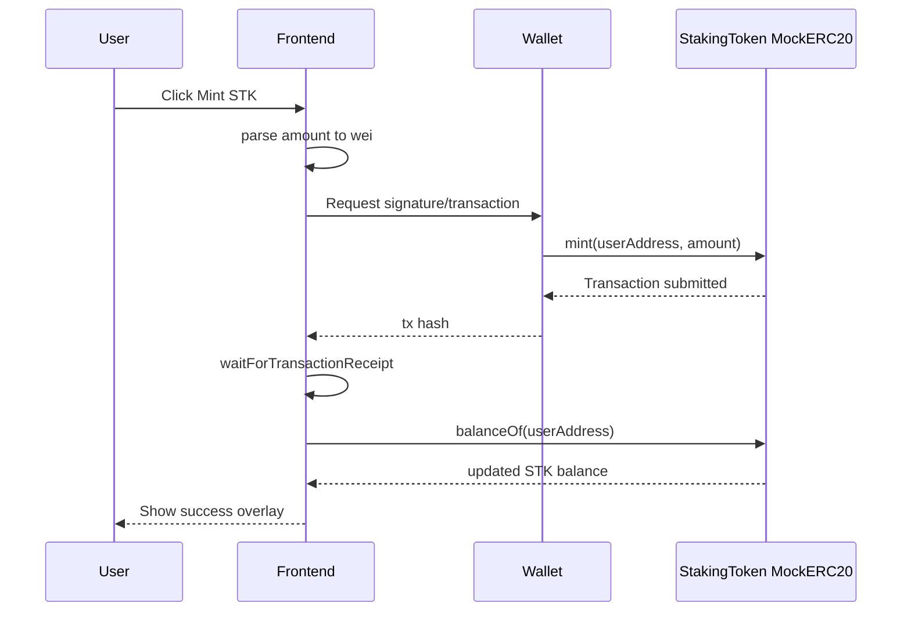

# Guide triển khai Faucet STK và onboarding testnet

## 1. Mục tiêu

Mục tiêu của phần mở rộng này là làm cho ứng dụng staking dễ dùng hơn với người dùng mới. Hiện frontend đã có Dashboard, Rewards, Admin và đã kết nối contract Sepolia thật, nhưng một ví mới gần như không có `STK` để approve/stake. Vì `StakingToken` trên Sepolia đang là `MockERC20` và có hàm `mint(address,uint256)` public, ta có thể thêm một faucet trực tiếp trên giao diện để người dùng tự mint một lượng `STK` testnet.

Sau khi có Faucet + onboarding, luồng dùng app sẽ thực tế hơn:

```text
Connect wallet -> Switch Sepolia -> Mint test STK -> Approve STK -> Stake -> Watch rewards -> Claim RWD
```

Đây là hướng phù hợp với môi trường testnet/capstone. Không nên áp dụng faucet public như vậy cho production token thật.

## 2. Thực tế hiện tại của project

### 2.1 Contract liên quan

`contracts/mocks/MockERC20.sol` hiện có:

```solidity
function mint(address to, uint256 amount) external {
    _mint(to, amount);
}
```

Hàm `mint` là `external` và không có `onlyOwner`, nên bất kỳ ví nào trên Sepolia cũng có thể gọi để mint token mock. Đây là điểm thuận lợi để làm faucet testnet.

### 2.2 Địa chỉ contract Sepolia

| Contract | Địa chỉ |
|---|---|
| `StakingRewards` | `0x8B30864bEF5B75C39D19Af249D6bbC4210B55963` |
| `StakingToken` / `STK` | `0x69F9e365D78dCB684DDe29ea6A05854273917db8` |
| `RewardsToken` / `RWD` | `0x20bF1B78E8B13B3273a27979725Faf1B74902e07` |

Faucet nên mint `STK`, không mint `RWD` cho user. `RWD` là reward token, nên phần reward pool vẫn nên do owner quản lý qua Admin panel.

### 2.3 Frontend hiện tại

Frontend nằm trong:

```text
frontend/
```

Stack:

| Thành phần | Công nghệ |
|---|---|
| UI | React + TypeScript |
| Build | Vite |
| Web3 | `viem` |
| Wallet | Injected EIP-1193 wallet, ví dụ MetaMask |
| Network | Sepolia |

ABI hiện tại trong `frontend/src/config/abis.ts` đã có `approve`, `transfer`, `balanceOf`, `allowance`, nhưng chưa có `mint`. Vì vậy bước triển khai faucet cần bổ sung ABI cho:

```text
mint(address to, uint256 amount)
```

## 3. Phạm vi triển khai

Phần mở rộng faucet nên gồm:

| Hạng mục | Mục tiêu |
|---|---|
| Faucet card | Cho user mint test `STK` nhanh trên giao diện. |
| Onboarding checklist | Hiển thị các bước cần làm để bắt đầu stake. |
| Auto refresh balance | Sau khi mint thành công, `STK Balance` refresh. |
| Transaction feedback | Dùng lại transaction panel/overlay hiện có. |
| Mobile support | Faucet và checklist dùng tốt trên mobile web. |
| Safety copy | Ghi rõ đây là testnet token, không có giá trị thật. |

Không cần deploy contract mới vì contract `MockERC20` đã có hàm mint public.

## 4. UX đề xuất

### 4.1 Vị trí đặt Faucet

Nên đặt Faucet ở `Dashboard`, gần khu vực stake controls, vì người dùng thường cần mint `STK` trước khi stake.

Layout đề xuất desktop:

```text
Dashboard
├── Account summary cards
├── Global Protocol Stats
├── Stake Controls
└── Testnet Onboarding
    ├── Faucet STK
    └── Checklist
```

Layout mobile:

```text
Dashboard
├── Account summary cards
├── Faucet STK
├── Stake Controls
├── Global Protocol Stats
└── Transaction Status
```

Trên mobile, Faucet nên xuất hiện trước hoặc ngay gần Stake Controls để người dùng không phải kéo quá sâu mới thấy.

### 4.2 Faucet card

Nội dung card:

| Thành phần | Nội dung |
|---|---|
| Title | `Testnet STK Faucet` |
| Mô tả | `Mint STK test tokens to try staking on Sepolia.` |
| Amount quick buttons | `100 STK`, `500 STK`, `1000 STK` |
| Custom input | Cho phép nhập amount tuỳ chọn |
| Primary action | `Mint STK` |
| Helper text | `These tokens are for Sepolia testing only.` |

Nên đặt default amount là `1000 STK`, vì đủ để stake thử nhiều lần.

### 4.3 Onboarding checklist

Checklist giúp user biết đang ở bước nào:

| Bước | Cách xác định hoàn thành |
|---|---|
| Connect wallet | `address !== undefined` |
| Switch to Sepolia | `chainId === 11155111` |
| Mint STK | `stakingTokenBalance > 0` |
| Approve STK | `allowance > 0` |
| Stake STK | `stakedBalance > 0` |
| Earn / claim RWD | `earnedReward > 0` hoặc đã claim thành công |

Giao diện checklist nên hiển thị trạng thái:

- Done: icon check màu xanh.
- Current: nhấn mạnh bằng màu primary.
- Pending: màu muted.

## 5. Luồng người dùng



## 6. Luồng kỹ thuật khi mint STK



## 7. Thay đổi code cần thực hiện

### 7.1 Bổ sung ABI mint

Trong `frontend/src/config/abis.ts`, thêm vào `erc20Abi`:

```ts
{
  type: "function",
  name: "mint",
  stateMutability: "nonpayable",
  inputs: [
    { name: "to", type: "address" },
    { name: "amount", type: "uint256" },
  ],
  outputs: [],
}
```

Lý do thêm vào `erc20Abi`: `StakingToken` là `MockERC20`, kế thừa ERC20 và có thêm hàm `mint`.

### 7.2 Thêm state cho faucet amount

Trong `App.tsx`, thêm state:

```ts
const [faucetAmount, setFaucetAmount] = useState("1000");
```

Có thể thêm quick amount:

```text
100
500
1000
```

### 7.3 Thêm handler `handleMintStk`

Handler dùng `walletClient().writeContract` tương tự các action hiện có:

```ts
function handleMintStk() {
  const amountWei = parseTokenAmount(faucetAmount);
  if (amountWei === null || amountWei <= 0n || !address) return;

  void execute("Mint test STK", () =>
    walletClient().writeContract({
      address: contracts.stakingToken,
      abi: erc20Abi,
      functionName: "mint",
      args: [address, amountWei],
    }),
  );
}
```

Sau khi transaction confirmed, `execute()` hiện đã gọi `loadState()`, nên balance sẽ tự refresh.

### 7.4 Tạo component Faucet

Có thể tạo component nội bộ trong `App.tsx` để giữ scope nhỏ:

```text
FaucetPanel
├── amount input
├── quick buttons
├── Mint STK button
└── helper text
```

Nút `Mint STK` disabled khi:

- Chưa connect wallet.
- Sai network.
- Amount không hợp lệ.
- Đang có transaction pending.

### 7.5 Tạo component OnboardingChecklist

Checklist nhận dữ liệu:

```text
address
chainId
stakingTokenBalance
allowance
stakedBalance
earnedReward
```

Các bước nên tính bằng boolean:

```ts
const steps = [
  { label: "Connect wallet", done: address !== undefined },
  { label: "Switch to Sepolia", done: chainId === sepolia.id },
  { label: "Mint STK", done: stakingTokenBalance > 0n },
  { label: "Approve STK", done: allowance > 0n },
  { label: "Stake STK", done: stakedBalance > 0n },
  { label: "Earn rewards", done: earnedReward > 0n },
];
```

## 8. UI text đề xuất

| Vị trí | Text |
|---|---|
| Faucet title | `Testnet STK Faucet` |
| Faucet description | `Mint free STK test tokens to try the staking flow on Sepolia.` |
| Helper | `These tokens are only for this capstone testnet deployment.` |
| Button | `Mint STK` |
| Success action | `Mint test STK confirmed.` |
| Checklist title | `Getting Started` |
| Checklist description | `Follow these steps to complete the staking flow.` |

Nếu muốn Việt hóa UI:

| Vị trí | Text tiếng Việt |
|---|---|
| Faucet title | `Faucet STK testnet` |
| Faucet description | `Mint STK test miễn phí để thử luồng staking trên Sepolia.` |
| Helper | `Token này chỉ dùng cho môi trường testnet của project.` |
| Button | `Mint STK` |
| Checklist title | `Bắt đầu sử dụng` |

Hiện UI chính đang dùng tiếng Anh, nên để đồng bộ có thể giữ tiếng Anh.

## 9. Vị trí hiển thị trong Dashboard

Đề xuất sửa `dashboardView` thành:

```text
Dashboard
├── accountSummary
├── main-grid
│   ├── left stack
│   │   ├── FaucetPanel
│   │   ├── protocolStatsPanel
│   │   └── OnboardingChecklist
│   └── stakeControlsPanel
```

Lý do:

- User nhìn thấy Faucet trước khi stake.
- Stake Controls vẫn nằm bên phải trên desktop.
- Mobile sẽ stack Faucet trước Stake Controls nếu chỉnh thứ tự hợp lý.

## 10. Kiểm thử sau triển khai

### 10.1 Test chức năng faucet

| Test | Kỳ vọng |
|---|---|
| Chưa connect ví | Faucet button disabled hoặc app yêu cầu connect. |
| Sai network | App hiện wrong network, không cho mint. |
| Amount trống | Button disabled. |
| Amount bằng 0 | Button disabled. |
| Amount hợp lệ | Click `Mint STK`, ví mở popup transaction. |
| User reject transaction | Transaction panel/overlay hiển thị failed. |
| Transaction confirmed | Overlay success, STK balance tăng. |
| Sau mint, nhập stake amount | Có thể approve/stake bằng STK vừa mint. |

### 10.2 Test checklist

| Test | Kỳ vọng |
|---|---|
| Chưa connect ví | Chỉ bước connect chưa done/current. |
| Connect ví Sepolia chưa có STK | Bước connect + Sepolia done, bước mint là current. |
| Sau khi mint STK | Bước mint done, bước approve là current. |
| Sau approve | Bước approve done, bước stake là current. |
| Sau stake | Bước stake done. |
| Khi có reward | Bước earn rewards done. |

### 10.3 Test mobile

| Test | Kỳ vọng |
|---|---|
| Mobile viewport | Faucet card không bị vỡ layout. |
| Bottom nav Dashboard | Vẫn truy cập được Faucet. |
| Input amount trên mobile | Không bị che bởi bottom nav. |
| Mint transaction overlay | Modal success/error hiển thị vừa màn hình. |

## 11. Preview state nên bổ sung

Frontend hiện đã có:

```text
?preview=disconnected
?preview=wrong-network
?preview=tx-success
?preview=tx-error
```

Sau khi thêm faucet, có thể bổ sung preview:

```text
?preview=faucet-empty
?preview=faucet-ready
?preview=faucet-success
```

Không bắt buộc, nhưng hữu ích nếu muốn kiểm thử UI mà không cần ví.

## 12. Rủi ro và giới hạn

| Rủi ro/giới hạn | Cách xử lý |
|---|---|
| `mint` public nên ai cũng mint vô hạn | Chấp nhận vì đây là mock token testnet. Ghi rõ trên UI. |
| User vẫn cần Sepolia ETH để trả gas | Thêm helper text nhắc cần Sepolia ETH. |
| Mint quá nhiều làm UI số lớn | Format token đã có, có thể giới hạn input UI ở mức hợp lý như 10,000 STK. |
| Không dùng cho production | Ghi rõ faucet chỉ dành cho capstone/testnet. |
| Reward token không faucet cho user | Giữ đúng logic staking: `RWD` là reward pool do owner fund. |

## 13. Tiêu chí hoàn thành

Faucet + onboarding được xem là hoàn thành khi:

- Có Faucet card trên Dashboard desktop.
- Có Faucet card dùng tốt trên mobile web.
- User có thể mint `STK` testnet vào chính ví đang connect.
- Sau khi mint, `STK Balance` refresh đúng.
- User có thể đi tiếp luồng approve -> stake.
- Có onboarding checklist hiển thị đúng trạng thái từng bước.
- Transaction panel/overlay dùng lại được cho mint success/error.
- `npm run build` pass.
- `npm audit --audit-level=moderate` không phát sinh vulnerability mới.

## 14. Kết luận

Faucet STK + onboarding testnet là bước mở rộng có giá trị thực tế cao nhất ở thời điểm hiện tại, vì nó biến frontend từ dashboard chỉ đọc/gửi giao dịch thành một trải nghiệm dùng được ngay cho ví mới. Người dùng không cần chờ owner chuyển `STK`, chỉ cần có Sepolia ETH để trả gas, mint test `STK`, approve và stake. Hướng này tận dụng đúng contract đã deploy, không cần redeploy, ít rủi ro và làm project dễ demo, dễ kiểm thử, dễ chia sẻ hơn.

