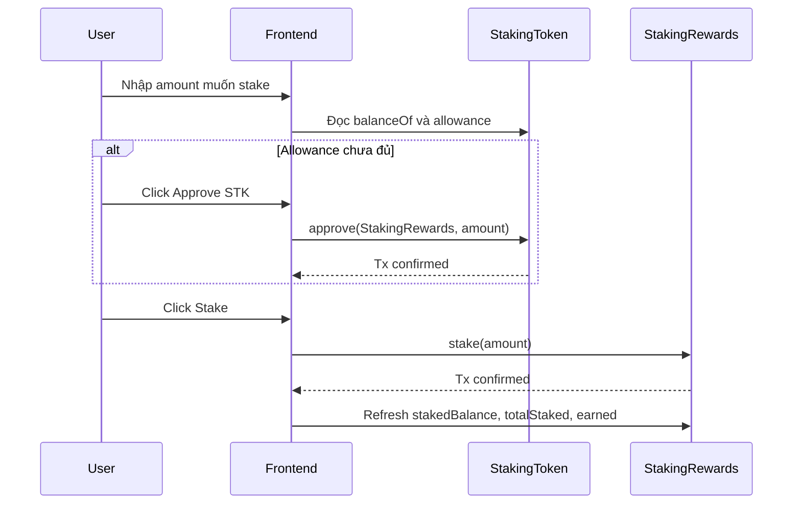
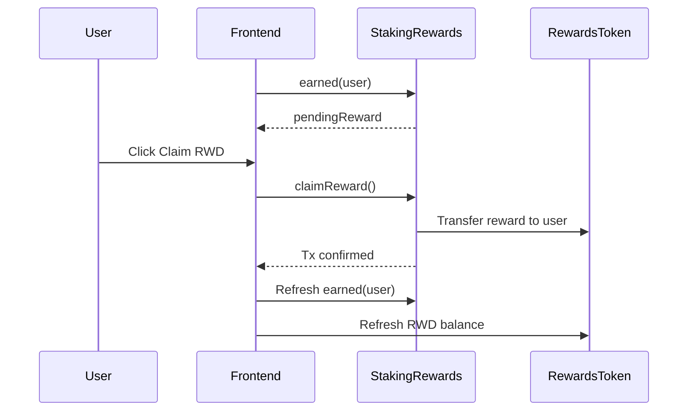

# Hướng dẫn thiết kế và xây dựng giao diện Staking bằng Google Stitch

## 1. Mục tiêu giao diện

Giao diện cần giúp người dùng tương tác trực quan với hệ thống `StakingRewards` đã triển khai trên Sepolia. Trọng tâm không phải là trang giới thiệu, mà là một dashboard Web3 có thể dùng ngay để:

- Kết nối ví.
- Kiểm tra đúng mạng Sepolia.
- Xem số dư `STK`, `RWD`, số token đang stake và reward đang chờ claim.
- Approve `STK`, stake, unstake và claim reward.
- Hiển thị trạng thái reward pool, `rewardRate`, `periodFinish`, `totalStaked`.
- Cho owner xem và dùng các thao tác quản trị: fund reward pool, notify reward amount, pause/unpause, set reward duration.
- Trực quan hóa reward accrual theo thời gian bằng số liệu, progress, chart hoặc timeline.

Google Stitch sẽ được dùng ở bước thiết kế UI: tạo bố cục, style, design system, luồng màn hình và prototype. Sau đó frontend thật sẽ được xây bằng React/TypeScript và kết nối contract bằng `wagmi`/`viem`.

## 2. Nguyên tắc thiết kế

Giao diện nên mang cảm giác của một Web3 dashboard chuyên nghiệp, rõ ràng và đáng tin. Đây là công cụ tương tác tài sản, nên ưu tiên tính dễ đọc, trạng thái rõ, thông báo giao dịch minh bạch và tránh trang trí quá nặng.

| Nguyên tắc | Áp dụng |
|---|---|
| Dễ kiểm tra trạng thái | Luôn hiển thị wallet, network, contract status và pending transaction. |
| Giảm rủi ro thao tác sai | Các nút write contract cần có confirm state, loading state, disabled state và lỗi rõ ràng. |
| Tách user/admin | Admin panel chỉ hiện khi connected wallet là owner. |
| Trực quan hóa reward | Pending reward, reward rate và thời gian còn lại nên có progress/timeline. |
| Không làm rối màn hình | Dùng dashboard layout gọn, dữ liệu chia thành nhóm rõ ràng. |
| Mobile usable | Các thao tác stake/unstake/claim vẫn phải dùng tốt trên màn hình nhỏ. |

## 3. Workflow tổng thể

```mermaid
flowchart LR
    A[Chuẩn bị yêu cầu UI] --> B[Prompt Google Stitch]
    B --> C[Chọn layout tốt nhất]
    C --> D[Tinh chỉnh design system]
    D --> E[Export sang Figma hoặc code tham khảo]
    E --> F[Xây frontend React TypeScript]
    F --> G[Kết nối ví và Sepolia]
    G --> H[Đọc dữ liệu contract]
    H --> I[Viết actions approve stake unstake claim]
    I --> J[Test bằng Sepolia contract thật]
```



## 4. Công cụ đề xuất

| Hạng mục | Công cụ |
|---|---|
| UI design | Google Stitch |
| Design handoff | Figma hoặc export code từ Stitch để tham khảo spacing/color |
| Frontend | Vite + React + TypeScript |
| Web3 connection | `wagmi` + `viem` |
| Wallet | MetaMask, WalletConnect nếu cần mở rộng |
| Query/cache | `@tanstack/react-query` |
| Icons | `lucide-react` |
| Styling | Tailwind CSS hoặc CSS Modules |
| Chart đơn giản | `recharts` nếu cần chart reward/timeline |
| Contract ABI | Lấy từ Hardhat artifacts hoặc copy ABI tối giản sang frontend |

## 5. Màn hình nên thiết kế trong Google Stitch

### 5.1 Wallet disconnected

Mục tiêu: người dùng chưa kết nối ví vẫn hiểu đây là staking dashboard và biết cần connect wallet.

Nội dung chính:

- Header có tên app: `Staking Rewards`.
- Nút `Connect Wallet`.
- Badge mạng yêu cầu: `Sepolia`.
- Vùng tóm tắt contract đã deploy: `StakingRewards`, `STK`, `RWD`.
- Trạng thái disabled cho các form stake/claim.

### 5.2 User dashboard

Mục tiêu: màn hình chính sau khi kết nối ví.

Nội dung chính:

- Wallet address rút gọn.
- Network badge: đúng Sepolia hoặc warning nếu sai mạng.
- Cards dữ liệu:
  - `My STK balance`.
  - `My staked STK`.
  - `Pending RWD`.
  - `Total staked`.
  - `Reward rate`.
  - `Reward period ends`.
- Khu vực thao tác:
  - Stake form.
  - Unstake form.
  - Claim reward button.
- Reward progress/timeline.
- Transaction status panel.

### 5.3 Stake/unstake interaction

Mục tiêu: thao tác rõ ràng, ít nhầm lẫn.

Nội dung chính:

- Amount input.
- Quick amount buttons: `25%`, `50%`, `Max`.
- Hiển thị allowance hiện tại.
- Nếu allowance chưa đủ: hiện nút `Approve STK`.
- Nếu allowance đủ: hiện nút `Stake`.
- Với unstake: amount không vượt quá `stakedBalance`.
- Validation message:
  - Amount phải lớn hơn 0.
  - Không vượt quá wallet balance hoặc staked balance.
  - Wallet phải ở Sepolia.

### 5.4 Rewards view

Mục tiêu: giúp người dùng thấy reward đang tăng và biết khi nào claim.

Nội dung chính:

- Pending reward hiện tại.
- Claimable estimate.
- Reward rate.
- Time left until `periodFinish`.
- Progress bar reward period.
- Last refreshed time.
- Claim button với loading/pending/success state.

### 5.5 Admin panel

Mục tiêu: owner quản trị reward pool và emergency controls.

Chỉ hiển thị khi connected wallet bằng contract owner.

Nội dung chính:

- Owner badge.
- Contract paused status.
- Fund reward pool:
  - Amount input.
  - Transfer `RWD` vào `StakingRewards`.
  - Sau khi transfer thành công, gọi `notifyRewardAmount`.
- Set rewards duration:
  - Input seconds/days.
  - Disable nếu reward period đang active.
- Pause/unpause:
  - Nút `Pause staking`.
  - Nút `Unpause staking`.
- Recover unrelated ERC20:
  - Token address input.
  - Amount input.
  - Warning: không thể recover staking token hoặc reward token.

### 5.6 Transaction history

Mục tiêu: người dùng thấy rõ giao dịch đang làm gì.

Nội dung chính:

- Pending transaction hash.
- Confirmed transaction hash.
- Link mở Sepolia Etherscan.
- Lịch sử gần nhất trong session:
  - Approve.
  - Stake.
  - Unstake.
  - Claim.
  - Admin actions.

## 6. Prompt mẫu cho Google Stitch

Nên prompt bằng tiếng Anh để Stitch hiểu chính xác hơn, nhưng yêu cầu text trong UI có thể là tiếng Anh hoặc tiếng Việt tùy bạn muốn. Prompt dưới đây ưu tiên UI tiếng Anh vì hợp với dashboard Web3.

```text
Design a production-quality Web3 staking dashboard for an ERC20 staking rewards smart contract on Sepolia.

Audience:
- Crypto users who want to stake STK tokens and earn RWD rewards.
- Contract owner who needs a compact admin panel.

Product goal:
- Make staking, unstaking, approving tokens, claiming rewards, and monitoring reward status clear and safe.
- The first screen must be the actual usable dashboard, not a marketing landing page.

Visual direction:
- Professional fintech/Web3 dashboard.
- Clean, calm, high-trust interface.
- Light mode by default with subtle dark text, white surfaces, thin borders, and restrained accent colors.
- Avoid decorative crypto clichés, oversized hero sections, and noisy gradients.
- Use compact cards, clear hierarchy, strong number formatting, and obvious transaction states.

Required screens:
1. Wallet disconnected state.
2. Connected user dashboard.
3. Stake and unstake form state.
4. Rewards claim state.
5. Owner admin panel state.
6. Wrong network state.
7. Pending transaction and success transaction states.

Required dashboard data:
- Connected wallet address.
- Current network, expected Sepolia.
- STK wallet balance.
- RWD wallet balance.
- User staked STK.
- Pending RWD reward.
- Total staked.
- Reward rate.
- Reward period end time.
- Reward period progress.
- Contract paused status.

Required actions:
- Connect wallet.
- Switch to Sepolia.
- Approve STK.
- Stake STK.
- Unstake STK.
- Claim RWD.
- Owner: fund reward pool.
- Owner: notify reward amount.
- Owner: set reward duration.
- Owner: pause and unpause staking.

UX details:
- Amount inputs should have 25%, 50%, Max shortcuts.
- Buttons need loading, disabled, error, and success states.
- Show short helper text for allowance and balances.
- Show Etherscan transaction links after confirmation.
- Admin panel should be visually separated and only appear for owner.
- Mobile layout should stack panels cleanly.

Deliverables:
- High-fidelity responsive web dashboard.
- Design system with colors, spacing, typography, buttons, inputs, cards, badges, and alerts.
- A clear component breakdown for frontend implementation.
```

## 7. Prompt chỉnh sửa sau khi Stitch tạo bản đầu

Sau khi Stitch tạo bản đầu, dùng các prompt ngắn để tinh chỉnh:

```text
Make the interface denser and more dashboard-like. Reduce marketing-style spacing. Keep the focus on balances, staking actions, reward status, and transaction feedback.
```

```text
Add a clear wrong-network state for when the wallet is not connected to Sepolia. The primary action should be "Switch to Sepolia".
```

```text
Create a separate owner-only admin panel. It should include reward pool funding, notify reward amount, set reward duration, pause/unpause, and recover unrelated ERC20 tokens.
```

```text
Create mobile versions for all screens. The stake form, reward panel, and transaction status should remain easy to use on a phone.
```

```text
Extract a design system with tokens for typography, color, spacing, card radius, buttons, inputs, badges, alerts, and transaction states.
```

## 8. Mapping UI với contract thực tế

### 8.1 Địa chỉ contract Sepolia

| Contract | Address |
|---|---|
| `StakingRewards` | `0x8B30864bEF5B75C39D19Af249D6bbC4210B55963` |
| `StakingToken` | `0x69F9e365D78dCB684DDe29ea6A05854273917db8` |
| `RewardsToken` | `0x20bF1B78E8B13B3273a27979725Faf1B74902e07` |

### 8.2 Read functions

| UI data | Contract/function |
|---|---|
| Contract owner | `StakingRewards.owner()` |
| Staking token address | `StakingRewards.stakingToken()` |
| Rewards token address | `StakingRewards.rewardsToken()` |
| User staked amount | `StakingRewards.stakedBalance(user)` |
| User stake timestamp | `StakingRewards.stakedAt(user)` |
| Total staked | `StakingRewards.totalStaked()` |
| Reward rate | `StakingRewards.rewardRate()` |
| Reward duration | `StakingRewards.rewardsDuration()` |
| Period finish | `StakingRewards.periodFinish()` |
| Pending reward | `StakingRewards.earned(user)` |
| STK wallet balance | `StakingToken.balanceOf(user)` |
| RWD wallet balance | `RewardsToken.balanceOf(user)` |
| STK allowance | `StakingToken.allowance(user, StakingRewards)` |
| Contract STK balance | `StakingToken.balanceOf(StakingRewards)` |
| Contract RWD balance | `RewardsToken.balanceOf(StakingRewards)` |

### 8.3 Write functions

| UI action | Contract/function |
|---|---|
| Approve STK | `StakingToken.approve(StakingRewards, amount)` |
| Stake | `StakingRewards.stake(amount)` |
| Unstake | `StakingRewards.unstake(amount)` |
| Claim reward | `StakingRewards.claimReward()` |
| Fund reward pool | `RewardsToken.transfer(StakingRewards, amount)` |
| Notify reward amount | `StakingRewards.notifyRewardAmount(amount)` |
| Set reward duration | `StakingRewards.setRewardsDuration(duration)` |
| Pause staking | `StakingRewards.pause()` |
| Unpause staking | `StakingRewards.unpause()` |
| Recover unrelated ERC20 | `StakingRewards.recoverERC20(tokenAddress, amount)` |

## 9. Luồng approve và stake



## 10. Luồng claim reward



## 11. Kiến trúc frontend đề xuất

Nên tạo frontend trong thư mục riêng để không làm lẫn với Hardhat project:

```text
frontend/
  src/
    app/
      App.tsx
      providers.tsx
    config/
      chains.ts
      contracts.ts
      abis/
        stakingRewards.ts
        erc20.ts
    hooks/
      useWalletStatus.ts
      useStakingReads.ts
      useStakingActions.ts
      useAdminActions.ts
    components/
      layout/
        AppShell.tsx
        Header.tsx
      dashboard/
        StatCard.tsx
        RewardProgress.tsx
        ContractStatus.tsx
      staking/
        StakeForm.tsx
        UnstakeForm.tsx
        ClaimRewardPanel.tsx
      admin/
        AdminPanel.tsx
        RewardFundingForm.tsx
        PauseControls.tsx
      transactions/
        TransactionToast.tsx
        TransactionList.tsx
      shared/
        AmountInput.tsx
        NetworkBadge.tsx
        EmptyState.tsx
        ErrorState.tsx
    lib/
      format.ts
      time.ts
      validation.ts
    styles/
      globals.css
```

## 12. Các bước triển khai frontend

### Bước 1: Tạo thiết kế trong Stitch

1. Dùng prompt chính ở mục 6.
2. Chọn biến thể giao diện tốt nhất.
3. Tinh chỉnh bằng các prompt ở mục 7.
4. Kiểm tra đủ các trạng thái: disconnected, connected, wrong network, pending transaction, success, error, owner.
5. Export sang Figma hoặc lấy code/css từ Stitch làm tham chiếu.

Không nên copy toàn bộ code Stitch rồi dùng ngay cho production. Nên xem output của Stitch là design reference: layout, spacing, màu, typography, component style.

### Bước 2: Tạo frontend app

Khuyến nghị dùng Vite React TypeScript:

```bash
npm create vite@latest frontend -- --template react-ts
```

Dependencies nên có:

```bash
cd frontend
npm install wagmi viem @tanstack/react-query lucide-react clsx
```

Nếu dùng Tailwind:

```bash
npm install -D tailwindcss postcss autoprefixer
```

### Bước 3: Chuẩn bị ABI và địa chỉ contract

Có hai cách:

| Cách | Khi nào dùng |
|---|---|
| Copy ABI tối giản vào frontend | Nhanh, phù hợp dashboard nhỏ. |
| Dùng generated artifacts/TypeChain/wagmi CLI | Tốt hơn khi frontend lớn và cần type safety mạnh. |

Với project hiện tại, cách nhanh là tạo:

```text
frontend/src/config/contracts.ts
frontend/src/config/abis/stakingRewards.ts
frontend/src/config/abis/erc20.ts
```

`contracts.ts` nên chứa:

- Sepolia chain id `11155111`.
- `STAKING_REWARDS_ADDRESS`.
- `STAKING_TOKEN_ADDRESS`.
- `REWARDS_TOKEN_ADDRESS`.
- Etherscan base URL.

### Bước 4: Kết nối ví

Frontend cần kiểm tra:

- Wallet đã connect chưa.
- Chain hiện tại có phải Sepolia không.
- Nếu sai chain, hiện state `Wrong Network`.
- Nếu đúng chain, load dashboard.

Các trạng thái UI cần có:

| State | UI response |
|---|---|
| Chưa connect ví | Hiện nút `Connect Wallet`, disable forms. |
| Sai network | Hiện warning và nút `Switch to Sepolia`. |
| Đang load reads | Skeleton hoặc loading nhỏ trong từng card. |
| Contract read lỗi | Error panel có nút retry. |
| Transaction pending | Disable nút liên quan, hiện tx hash nếu có. |
| Transaction success | Refresh data và hiện Etherscan link. |
| Transaction failed | Hiện lỗi ngắn, không mất input của user. |

### Bước 5: Xây hook đọc dữ liệu

`useStakingReads.ts` nên gom các read cần thiết:

- `owner`.
- `stakedBalance(user)`.
- `earned(user)`.
- `totalStaked`.
- `rewardRate`.
- `rewardsDuration`.
- `periodFinish`.
- token balances.
- allowance.
- contract token balances.

Nên refresh:

- Sau mỗi transaction thành công.
- Theo interval ngắn cho `earned(user)` nếu reward period đang active.
- Khi user đổi wallet hoặc đổi network.

### Bước 6: Xây hook write actions

`useStakingActions.ts`:

- `approveStakeToken(amount)`.
- `stake(amount)`.
- `unstake(amount)`.
- `claimReward()`.

`useAdminActions.ts`:

- `fundRewardPool(amount)`.
- `notifyRewardAmount(amount)`.
- `setRewardsDuration(duration)`.
- `pause()`.
- `unpause()`.
- `recoverERC20(tokenAddress, amount)`.

Mỗi action cần trả về:

- loading state.
- transaction hash.
- confirmed state.
- error message.

### Bước 7: Áp dụng thiết kế từ Stitch

Sau khi có code chức năng, dùng thiết kế Stitch để map thành component:

| Stitch design | React component |
|---|---|
| Top navigation | `Header` |
| Wallet/network area | `WalletStatus`, `NetworkBadge` |
| Data cards | `StatCard` |
| Stake panel | `StakeForm` |
| Unstake panel | `UnstakeForm` |
| Rewards panel | `ClaimRewardPanel`, `RewardProgress` |
| Owner area | `AdminPanel` |
| Transaction feedback | `TransactionToast`, `TransactionList` |

### Bước 8: Test giao diện với contract thật

Checklist test thủ công:

| Test | Kỳ vọng |
|---|---|
| Mở app khi chưa connect ví | Hiện disconnected state. |
| Connect ví ở network khác | Hiện wrong network state. |
| Switch sang Sepolia | Dashboard load dữ liệu contract. |
| Nhập amount stake lớn hơn balance | Nút stake disabled, hiện lỗi. |
| Allowance chưa đủ | Hiện approve trước stake. |
| Approve thành công | Allowance refresh, stake được bật. |
| Stake thành công | `stakedBalance` và `totalStaked` tăng. |
| Unstake thành công | `stakedBalance` giảm, STK wallet balance tăng. |
| Reward đang active | `earned(user)` tăng theo thời gian. |
| Claim thành công | Pending reward về 0, RWD balance tăng. |
| Wallet không phải owner | Không hiện admin panel. |
| Wallet là owner | Hiện admin panel. |

## 13. Trực quan hóa dữ liệu staking

Các thành phần trực quan nên có:

| Thành phần | Dữ liệu dùng |
|---|---|
| Reward period progress | `periodFinish`, thời gian hiện tại, `rewardsDuration` |
| Pending reward counter | `earned(user)` |
| Reward rate display | `rewardRate` format sang RWD/second hoặc RWD/day |
| Total staked card | `totalStaked` |
| User position summary | `stakedBalance(user)`, `earned(user)`, wallet balances |
| Pool health | RWD balance trong staking contract, `rewardRate`, time left |

Gợi ý format:

- STK/RWD nên hiển thị tối đa 4-6 chữ số thập phân.
- Address nên rút gọn dạng `0x1234...abcd`.
- Timestamp nên hiển thị cả countdown và ngày giờ.
- Reward rate nên có đơn vị dễ hiểu hơn raw wei, ví dụ `RWD/day`.

## 14. Những lỗi UX cần tránh

| Lỗi | Cách tránh |
|---|---|
| Cho stake khi chưa approve đủ | Kiểm tra allowance trước, hiện approve flow. |
| Cho unstake quá số dư | Validate theo `stakedBalance(user)`. |
| Không báo sai network | Luôn hiện network badge và blocking state. |
| Không refresh sau transaction | Invalidate/refetch reads sau khi tx confirmed. |
| Hiển thị raw wei | Dùng `formatEther` hoặc formatter tương đương. |
| Admin panel lộ cho mọi user | Chỉ hiện khi `account === owner`. |
| Claim button bật khi reward bằng 0 | Disable và ghi rõ `No reward to claim`. |
| Không phân biệt pending/confirmed | Tách rõ state khi tx đã gửi và khi đã confirmed. |

## 15. Tiêu chí hoàn thiện

Giao diện được xem là đạt khi:

- Người dùng có thể connect wallet và chuyển đúng Sepolia.
- Dashboard đọc đúng dữ liệu từ 3 contract đã deploy.
- Flow approve -> stake chạy thành công.
- Flow unstake chạy thành công.
- Flow claim reward chạy thành công khi có reward.
- Admin panel chỉ hiện cho owner.
- Các action owner hoạt động đúng với contract.
- UI có loading, error, success và transaction link.
- Mobile layout không vỡ.
- Thiết kế bám được style đã chọn trong Google Stitch.

## 16. Nguồn tham khảo về Google Stitch

- Google Stitch product: https://stitch.withgoogle.com/
- Google Blog, "Introducing vibe design with Stitch": https://blog.google/innovation-and-ai/models-and-research/google-labs/stitch-ai-ui-design/

