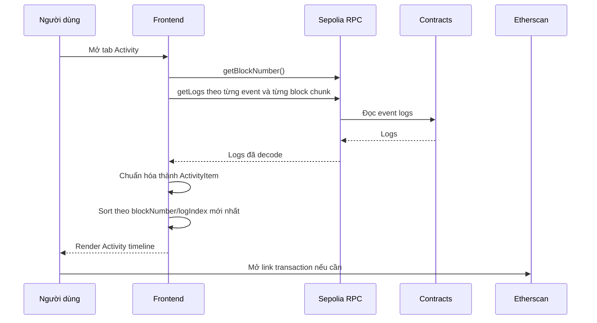
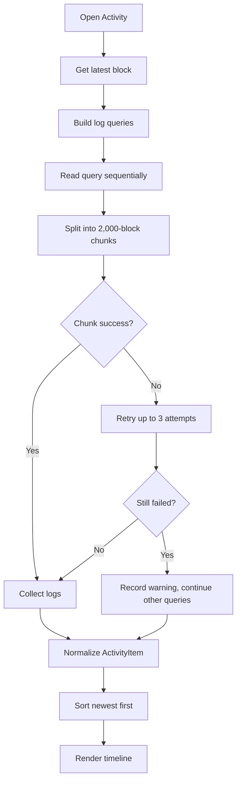

# Báo cáo triển khai Activity / Transaction History

## 1. Tóm tắt

Tính năng `Activity History` đã được triển khai vào frontend `Staking Core` để người dùng có thể xem lại lịch sử hoạt động on-chain liên quan đến ví đang kết nối trên Sepolia.

Màn Activity không dùng dữ liệu giả và không chỉ lưu local trong trình duyệt. Dữ liệu được đọc trực tiếp từ event logs của các contract đã deploy:

```text
StakingRewards
StakingToken / STK
RewardsToken / RWD
```

Các hoạt động đang được hỗ trợ:

| Nhóm | Activity |
|---|---|
| Wallet | Mint STK |
| Wallet | Approve STK |
| Wallet | Stake STK |
| Wallet | Unstake STK |
| Wallet | Claim RWD |
| Wallet | Fund Reward Pool |
| Admin/Owner | Notify Reward Amount |
| Admin/Owner | Update Reward Duration |
| Admin/Owner | Recover ERC20 |

Sau khi sửa lỗi RPC, người dùng đã kiểm tra lại và xác nhận Activity hoạt động trơn tru.

## 2. Mục tiêu triển khai

Trước khi có Activity History, frontend đã có thể thao tác staking đầy đủ: mint `STK`, approve, stake, unstake, claim reward và quản trị reward pool. Tuy nhiên app chưa có nơi để người dùng xem lại các hành động đã thực hiện.

Activity History được thêm vào để giải quyết các nhu cầu:

| Nhu cầu | Cách đáp ứng |
|---|---|
| Xem lại lịch sử thao tác | Đọc event logs từ Sepolia. |
| Biết giao dịch nào đã xảy ra | Hiển thị title, amount, block và tx hash. |
| Kiểm tra sau khi mint/stake/unstake/claim | Reload Activity để thấy log mới. |
| Dễ truy vết giao dịch | Mỗi activity có link sang Etherscan. |
| Làm app giống sản phẩm thực tế hơn | Có màn lịch sử riêng trong navigation. |

## 3. Địa chỉ contract thực tế

Activity History đọc log từ các contract đã deploy trên Sepolia:

| Contract | Địa chỉ |
|---|---|
| `StakingRewards` | `0x8B30864bEF5B75C39D19Af249D6bbC4210B55963` |
| `StakingToken` / `STK` | `0x69F9e365D78dCB684DDe29ea6A05854273917db8` |
| `RewardsToken` / `RWD` | `0x20bF1B78E8B13B3273a27979725Faf1B74902e07` |
| Owner/deployer | `0xBdE29b2fe1B0CD9b0d134D2690D14f787Fc8A985` |

Block bắt đầu đọc log:

```text
11001025
```

Đây là block deploy token `STK` và `RWD`, nên đủ để bao phủ toàn bộ hoạt động của project mà không cần quét toàn bộ Sepolia.

## 4. Các file đã cập nhật

| File | Nội dung |
|---|---|
| `guide/activity-history-guide.md` | Guide triển khai Activity History, đã cập nhật theo cơ chế sửa lỗi RPC thực tế. |
| `frontend/src/config/abis.ts` | Bổ sung event ABI cho ERC20 và StakingRewards. |
| `frontend/src/config/contracts.ts` | Bổ sung danh sách RPC fallback cho Sepolia. |
| `frontend/src/App.tsx` | Thêm state, logic đọc logs, màn Activity, navigation và timeline. |
| `frontend/src/styles.css` | Thêm style cho Activity list, toolbar, empty/error state và mobile nav 4 mục. |

## 5. Event ABI đã bổ sung

Để đọc được logs bằng `viem`, frontend đã bổ sung event ABI.

### 5.1 ERC20 events

Được dùng cho `STK` và `RWD`:

| Event | Mục đích |
|---|---|
| `Transfer(address indexed from, address indexed to, uint256 value)` | Nhận diện mint STK và fund reward pool. |
| `Approval(address indexed owner, address indexed spender, uint256 value)` | Nhận diện approve STK cho staking contract. |

### 5.2 StakingRewards events

Được dùng cho activity nghiệp vụ chính:

| Event | Mục đích |
|---|---|
| `Staked(address indexed user, uint256 amount)` | User stake STK. |
| `Withdrawn(address indexed user, uint256 amount)` | User unstake STK. |
| `RewardPaid(address indexed user, uint256 reward)` | User claim RWD. |
| `RewardAdded(uint256 reward)` | Owner notify reward amount. |
| `RewardsDurationUpdated(uint256 newDuration)` | Owner cập nhật reward duration. |
| `Recovered(address indexed token, uint256 amount)` | Owner recover ERC20 token. |

## 6. Luồng đọc Activity

Màn Activity chỉ chạy khi ví đã kết nối và đang ở Sepolia.

Luồng xử lý:



## 7. Mapping activity thực tế

| Activity hiển thị | Contract | Event | Filter |
|---|---|---|---|
| Mint STK | `StakingToken` | `Transfer` | `from = zeroAddress`, `to = connected wallet` |
| Approve STK | `StakingToken` | `Approval` | `owner = connected wallet`, `spender = StakingRewards` |
| Stake STK | `StakingRewards` | `Staked` | `user = connected wallet` |
| Unstake STK | `StakingRewards` | `Withdrawn` | `user = connected wallet` |
| Claim RWD | `StakingRewards` | `RewardPaid` | `user = connected wallet` |
| Fund Reward Pool | `RewardsToken` | `Transfer` | `from = connected wallet`, `to = StakingRewards` |
| Notify Reward Amount | `StakingRewards` | `RewardAdded` | Chỉ đọc khi connected wallet là owner |
| Update Reward Duration | `StakingRewards` | `RewardsDurationUpdated` | Chỉ đọc khi connected wallet là owner |
| Recover ERC20 | `StakingRewards` | `Recovered` | Chỉ đọc khi connected wallet là owner |

## 8. Thiết kế UI

Navigation đã được bổ sung màn `Activity`:

```text
Dashboard | Rewards | Activity | Admin
```

Trên desktop:

| Thành phần | Mô tả |
|---|---|
| Sidebar | Có thêm item `Activity`. |
| Page heading | Tiêu đề `Activity History`, mô tả ví đang được đọc log. |
| Summary cards | Activities, Wallet Logs, Admin Logs, From Block. |
| Recent Activity panel | Hiển thị timeline activity và nút `Reload`. |
| Transaction Status | Vẫn giữ panel trạng thái transaction hiện có. |

Trên mobile:

| Thành phần | Mô tả |
|---|---|
| Bottom navigation | Chuyển sang 4 mục: Dashboard, Rewards, Activity, Admin. |
| Activity item | Tự xuống dòng, tránh tràn hash/amount. |
| Toolbar | Xếp dọc trên màn nhỏ. |

Mỗi activity item hiển thị:

| Trường | Nội dung |
|---|---|
| Icon | Theo loại activity. |
| Title | Ví dụ `Mint STK`, `Stake STK`, `Claim RWD`. |
| Scope | `Wallet` hoặc `Admin`. |
| Description | Diễn giải hành động. |
| Value | Amount kèm token nếu có. |
| Block | Block number của log. |
| Tx hash | Short hash kèm link Etherscan. |

## 9. Cấu trúc dữ liệu Activity

Frontend chuẩn hóa log thành dạng `ActivityItem`:

```text
id
type
title
description
valueLabel
hash
blockNumber
logIndex
scope
```

Các item được sort theo:

```text
blockNumber giảm dần -> logIndex giảm dần
```

Nhờ vậy activity mới nhất luôn nằm trên cùng.

## 10. Lỗi HTTP request failed và cách đã xử lý

Trong quá trình test thực tế, màn Activity ban đầu hiển thị lỗi:

```text
HTTP request failed.
```

Nguyên nhân kiểm tra được:

| Vấn đề | Chi tiết |
|---|---|
| RPC mặc định của `viem` | Đang dùng endpoint thirdweb mặc định cho Sepolia. |
| Giới hạn `eth_getLogs` | RPC trả lỗi giới hạn block range và/hoặc request. |
| Gọi quá nhiều logs song song | `Promise.all` nhiều nhóm event khiến RPC dễ bị rate limit. |
| `https://rpc.sepolia.org` | Test thực tế trả `404`, không phù hợp để dùng trong app. |

Sau khi kiểm tra, frontend đã được sửa:

| Cách sửa | Kết quả |
|---|---|
| Thêm `SEPOLIA_RPC_URLS` | Có danh sách RPC rõ ràng trong config. |
| Dùng `fallback` transport của `viem` | Nếu RPC chính lỗi, có endpoint dự phòng. |
| RPC chính đổi sang PublicNode | `https://ethereum-sepolia-rpc.publicnode.com`. |
| RPC phụ dùng thirdweb | `https://11155111.rpc.thirdweb.com`. |
| Bỏ `https://rpc.sepolia.org` khỏi add-network | Tránh endpoint đang trả 404. |
| Giảm chunk còn `2,000` block/lần | An toàn hơn với giới hạn `eth_getLogs`. |
| Đọc log tuần tự | Không còn bắn nhiều request cùng lúc. |
| Retry nhẹ từng chunk | Giảm lỗi tạm thời từ public RPC. |
| Partial result | Nếu một nhóm log lỗi, app vẫn hiển thị các log đọc được. |

Luồng đọc log sau khi sửa:



## 11. RPC cấu hình hiện tại

Trong `frontend/src/config/contracts.ts`, Sepolia RPC hiện dùng:

```text
https://ethereum-sepolia-rpc.publicnode.com
https://11155111.rpc.thirdweb.com
```

Frontend dùng `fallback` transport:

```text
PublicNode -> Thirdweb fallback
```

Cấu hình này được dùng cho:

| Tác vụ | Có dùng |
|---|---|
| Đọc state bằng `readContract` | Có |
| Đọc activity bằng `getLogs` | Có |
| Đợi transaction receipt | Có |
| Add Sepolia network vào ví | Có |

## 12. Kết quả test thực tế

Sau khi sửa, đã test trực tiếp bằng script đọc log Sepolia với ví owner/deployer:

| Loại log | Số lượng đọc được |
|---|---:|
| Stake | 4 |
| Unstake | 2 |
| Claim | 3 |
| Mint | 3 |
| Approve | 4 |

Điều này xác nhận:

| Kết luận | Trạng thái |
|---|---|
| Contract có event logs thật | Có |
| Filter theo ví hoạt động | Có |
| RPC mới đọc được logs | Có |
| Lỗi không phải do thiếu event | Đúng |
| Activity có dữ liệu sau khi sửa | Có |

Người dùng cũng đã kiểm tra trên giao diện và xác nhận Activity hoạt động trơn tru.

## 13. Kiểm tra kỹ thuật đã chạy

Các kiểm tra sau khi sửa Activity:

| Kiểm tra | Kết quả |
|---|---|
| `npm run build` trong `frontend/` | Thành công |
| TypeScript check | Thành công |
| Vite production build | Thành công |
| `npm audit --audit-level=moderate` | `found 0 vulnerabilities` |
| HTTP check `http://127.0.0.1:5173/` | `200 OK` |
| HTTP check `http://127.0.0.1:5173/?preview=tx-error` | `200 OK` |

Build output sau khi sửa:

```text
dist/index.html
dist/assets/index-DQW3cIS5.css
dist/assets/ccip-DwzLOg59.js
dist/assets/index-C_-lWFSo.js
```

## 14. Cách test lại trên giao diện

Quy trình test:

```text
1. Mở frontend local.
2. Connect ví MetaMask.
3. Đảm bảo network là Sepolia.
4. Thực hiện Mint STK / Approve / Stake / Unstake / Claim.
5. Vào tab Activity.
6. Bấm Reload.
7. Kiểm tra activity mới xuất hiện ở đầu danh sách.
8. Bấm tx hash để mở Etherscan nếu cần đối chiếu.
```

Các case đã phù hợp để test:

| Case | Kết quả mong đợi |
|---|---|
| Mint STK | Có item `Mint STK`. |
| Approve STK | Có item `Approve STK`. |
| Stake STK | Có item `Stake STK`. |
| Unstake STK | Có item `Unstake STK`. |
| Claim RWD | Có item `Claim RWD`. |
| Owner fund reward pool | Có item `Fund Reward Pool`. |
| Owner notify reward | Có item `Notify Reward Amount`. |
| Mobile viewport | Activity list không tràn layout. |

## 15. Giới hạn hiện tại

| Giới hạn | Ghi chú |
|---|---|
| Dữ liệu phụ thuộc public RPC | Nếu cả hai RPC public đều lỗi, Activity có thể tạm thời không load được. |
| Chưa có backend indexer | Mỗi lần reload là đọc logs trực tiếp từ Sepolia. |
| Chưa có timestamp | Hiện hiển thị block number, chưa đọc block timestamp để giảm RPC call. |
| Admin event chỉ mở khi ví là owner | Đúng với logic hiện tại, tránh làm rối giao diện user thường. |
| Chỉ đọc contract capstone | Không phải toàn bộ lịch sử ví trên Sepolia. |

## 16. Hướng mở rộng sau này

Nếu muốn nâng cấp Activity thành module hoàn chỉnh hơn, có thể làm tiếp:

| Hướng mở rộng | Giá trị |
|---|---|
| Đọc block timestamp có cache | Hiển thị ngày giờ thật cho mỗi activity. |
| Filter theo loại activity | Lọc Mint/Stake/Claim/Admin. |
| Pagination hoặc limit recent logs | Tối ưu khi dữ liệu lớn. |
| Export CSV | Hữu ích cho báo cáo và kiểm toán. |
| Backend/indexer riêng | Ổn định hơn public RPC nếu app public nhiều người dùng. |
| Notification khi có activity mới | Cải thiện UX sau transaction. |

## 17. Kết luận

Activity / Transaction History đã được triển khai đúng theo thực tế của project và đã hoạt động ổn sau khi xử lý vấn đề RPC.

Tính năng hiện tại giúp frontend không chỉ là nơi gửi transaction, mà còn là nơi theo dõi lại lịch sử sử dụng staking app trên Sepolia. Người dùng có thể kiểm tra các thao tác như mint, approve, stake, unstake, claim reward và mở Etherscan để đối chiếu transaction.

Trạng thái cuối cùng:

```text
Guide đã có
Frontend đã triển khai
RPC issue đã sửa
Build thành công
Audit frontend sạch
Dev server chạy OK
Người dùng test Activity OK
```
