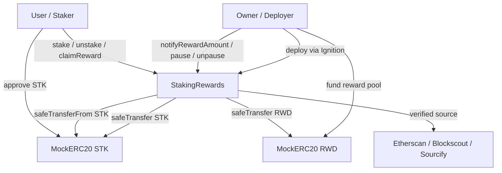
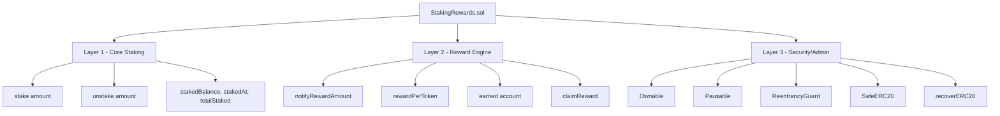
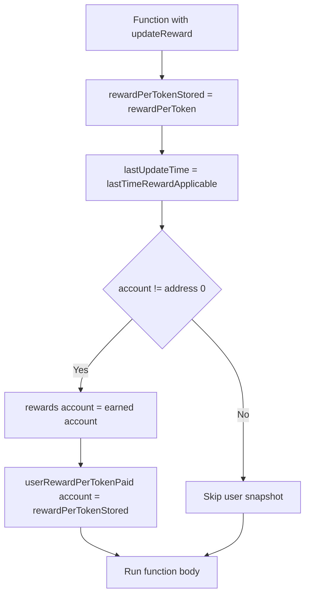
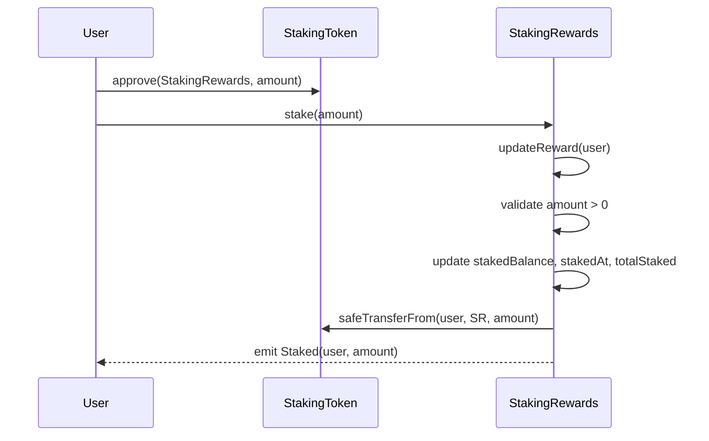
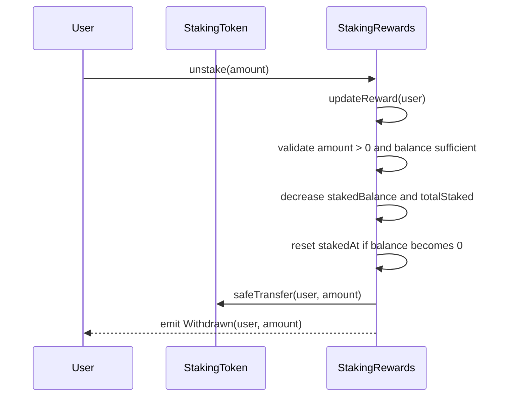
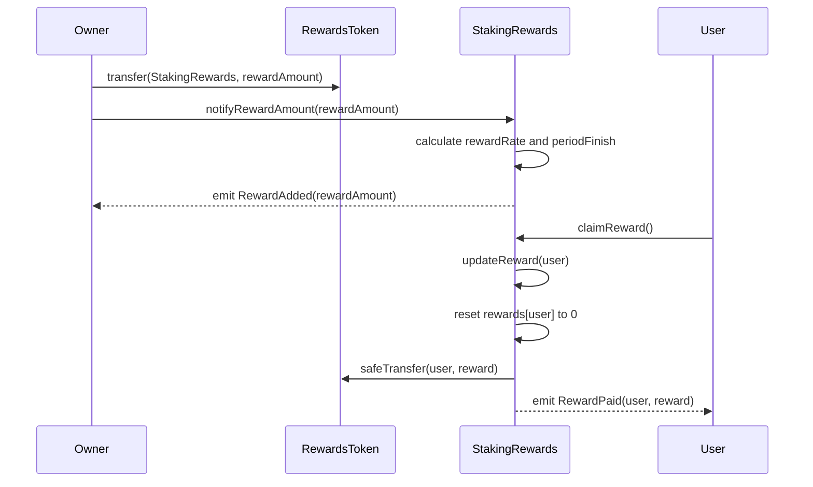
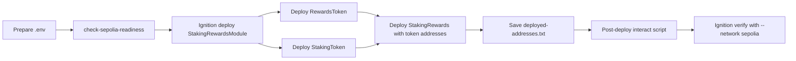

# Staking Contract - Capstone Project Report

## 1. Tóm tắt kết quả

Project `StakingRewards` là smart contract ERC20 staking cho phép user stake token `STK` để nhận reward token `RWD` theo thời gian. Contract đã được xây dựng theo Reward Engine dạng Accumulator Pattern, không loop qua danh sách user, tính reward theo O(1), và đã deploy/verify thành công trên Sepolia.

Tài liệu này tổng hợp chi tiết các hạng mục đã triển khai trong project: cấu hình môi trường, smart contract, test suite, deploy Sepolia, verify source code và trạng thái on-chain hiện tại.

| Hạng mục | Kết quả thực tế |
|---|---|
| Smart contract chính | `contracts/StakingRewards.sol` |
| ERC20 mock tokens | `contracts/mocks/MockERC20.sol` |
| Framework | Hardhat 3, TypeScript, ESM |
| Solidity | `0.8.20`, optimizer enabled, 200 runs |
| Thư viện contract | OpenZeppelin Contracts `^5.6.1` |
| Deploy | Hardhat Ignition |
| Testnet | Sepolia, chain id `11155111` |
| Verification | Etherscan, Blockscout, Sourcify |
| Unit tests | 16/16 passing |
| Contract size | `StakingRewards` 4476 bytes, `MockERC20` 1883 bytes |
| Audit tooling | 11 low severity dependency issues từ Hardhat verify/elliptic, không force fix vì gây breaking change |

## 2. Trạng thái theo yêu cầu

| Yêu cầu | File/logic thực tế | Trạng thái | Ghi chú |
|---|---|---|---|
| User stake ERC20 token | `stake(uint256)` | Hoàn tất | User có thể approve và stake `STK` vào contract. |
| Ghi nhận amount khi stake | `stakedBalance[address]` | Hoàn tất | Balance từng user được cập nhật khi stake/unstake. |
| Ghi nhận timestamp khi stake | `stakedAt[address]` | Hoàn tất | Timestamp được set khi stake và reset về 0 khi user unstake hết. |
| Owner withdraw/admin withdraw | `recoverERC20(address,uint256)` | Điều chỉnh an toàn | Thực tế không cho owner rút staking token/reward token để tránh rút tài sản user hoặc reward pool. Owner chỉ recover token ERC20 khác bị gửi nhầm. |
| Deploy lên testnet | Ignition deployment `staking-sepolia-v1` | Hoàn tất | Đã deploy 3 contract lên Sepolia. |
| Verify trên Etherscan | `npx hardhat ignition verify staking-sepolia-v1 --network sepolia` | Hoàn tất | Cả 3 contract đã verify. |
| Gửi link Etherscan và source code | Xem mục deployment/verification | Hoàn tất | Link verified code nằm trong báo cáo và `deployed-addresses.txt`. |
| Reward Engine O(1) | `rewardPerToken()`, `earned()` | Hoàn tất | Accumulator Pattern, không loop qua user. |
| User claim reward | `claimReward()` | Hoàn tất | User có thể claim reward đang accrued. |
| Owner nạp reward pool | `notifyRewardAmount(uint256)` | Hoàn tất | Reward token phải được transfer vào contract trước, sau đó owner notify. |
| Pausable | `pause()`, `unpause()` | Hoàn tất | Pause chặn stake/unstake, claim reward vẫn được phép. |
| ReentrancyGuard | `nonReentrant` | Hoàn tất | Áp dụng cho stake, unstake, claimReward, recoverERC20. |
| Custom errors | `ZeroAmount`, `ProvidedRewardTooHigh`, ... | Hoàn tất | Dùng custom errors thay vì require string. |
| Events đầy đủ | `Staked`, `Withdrawn`, `RewardAdded`, `RewardPaid`, ... | Hoàn tất | Các event chính có indexed user/token khi cần. |

## 3. Tech stack và cấu hình project

| Thành phần | Thực tế trong project |
|---|---|
| Package manager | npm |
| Module system | ESM, `type: "module"` trong `package.json` |
| Hardhat | `^3.8.0` |
| Hardhat toolbox | `@nomicfoundation/hardhat-toolbox-mocha-ethers` |
| Deploy module | `@nomicfoundation/hardhat-ignition`, `@nomicfoundation/hardhat-ignition-ethers` |
| Solidity compiler | `0.8.20` |
| Compiler optimizer | Enabled, `runs: 200` |
| TypeScript | `^6.0.3`, strict mode |
| OpenZeppelin | `@openzeppelin/contracts ^5.6.1` |
| Env loader | `dotenv` |
| Test runner | Hardhat Mocha + Chai + Ethers v6 style API |
| Sepolia config | Chỉ bật network khi `SEPOLIA_RPC_URL` tồn tại |
| Verify config | `verify.etherscan.apiKey` lấy từ `ETHERSCAN_API_KEY` |

Scripts đang có trong `package.json`:

| Script | Mục đích |
|---|---|
| `npm run compile` | Compile smart contracts |
| `npm test` | Chạy Hardhat test suite |
| `npm run build` | Alias compile |
| `npm run size` | Chạy custom task `hardhat size-contracts` |
| `npm run check:sepolia` | Kiểm tra env, signer, balance Sepolia |
| `npm run interact:sepolia` | Nạp reward pool và stake một amount mẫu |
| `npm run read:sepolia` | Đọc state contract đã deploy trên Sepolia |

## 4. Cấu trúc source code

| Đường dẫn | Vài trò |
|---|---|
| `contracts/StakingRewards.sol` | Contract chính quản lý stake, reward accounting, claim, admin controls và security. |
| `contracts/mocks/MockERC20.sol` | ERC20 mock token để deploy `STK` và `RWD` trên testnet/local. |
| `test/StakingRewards.test.ts` | Unit test suite 16 case. |
| `ignition/modules/StakingRewards.ts` | Hardhat Ignition module deploy `StakingToken`, `RewardsToken`, `StakingRewards`. |
| `scripts/check-sepolia-readiness.ts` | Kiểm tra `.env`, deployer address và Sepolia ETH balance. |
| `scripts/interact.ts` | Script post-deploy để fund reward pool và stake amount mẫu. |
| `scripts/read-deployment-state.ts` | Script đọc owner, token addresses, totalStaked, balances, earned reward. |
| `hardhat.config.ts` | Cấu hình compiler, network, verify, custom size task. |
| `.env.example` | Mẫu biến môi trường cần có. |
| `deployed-addresses.txt` | Lưu địa chỉ deploy, block, tx hash và verify links. |

## 5. Kiến trúc tổng thể



Kien truc trong contract co the chia thanh 3 layer dung theo tinh than guide:



## 6. Contract roles

| Contract | Địa chỉ Sepolia | Vài trò |
|---|---|---|
| `MockERC20` - StakingToken | `0x69F9e365D78dCB684DDe29ea6A05854273917db8` | Token `STK` user stake vào staking contract. |
| `MockERC20` - RewardsToken | `0x20bF1B78E8B13B3273a27979725Faf1B74902e07` | Token `RWD` dùng để trả reward. |
| `StakingRewards` | `0x8B30864bEF5B75C39D19Af249D6bbC4210B55963` | Contract chính tính reward, giữ staking token, trả reward token. |

`MockERC20` mint sẫn `1,000,000` token cho deployer khi deploy. Hàm `mint(address,uint256)` trong mock để tiện cho test và tương tác trên testnet; với production token thật, phần mint public này sẽ không nên dùng.

## 7. State variables chính

| Biến | Kiểu | Ý nghĩa |
|---|---|---|
| `PRECISION` | `uint256 constant` | Scale factor `1e18` để tính reward theo fixed-point. |
| `stakingToken` | `IERC20 immutable` | ERC20 token được stake. |
| `rewardsToken` | `IERC20 immutable` | ERC20 token được trả reward. |
| `stakedBalance` | `mapping(address => uint256)` | Số token mỗi account đang stake. |
| `stakedAt` | `mapping(address => uint256)` | Timestamp lần stake gần nhất của account, reset khi unstake hết. |
| `totalStaked` | `uint256` | Tổng STK đang nằm trong staking contract. |
| `rewardRate` | `uint256` | Số reward token phân bố mỗi giây. |
| `rewardsDuration` | `uint256` | Độ dài reward period, default `7 days`. |
| `periodFinish` | `uint256` | Timestamp kết thúc reward period hiện tại. |
| `lastUpdateTime` | `uint256` | Lần gần nhất global reward accumulator được update. |
| `rewardPerTokenStored` | `uint256` | Accumulator global, scaled theo `PRECISION`. |
| `userRewardPerTokenPaid` | `mapping(address => uint256)` | Snapshot accumulator user đã được ghi nhận. |
| `rewards` | `mapping(address => uint256)` | Reward đã accrued nhưng chưa claim của user. |

## 8. Public/external functions

| Function | Quyền gọi | Modifier | Hành vi chính |
|---|---|---|---|
| `stake(uint256 amount)` | User | `updateReward`, `nonReentrant`, `whenNotPaused` | Update reward trước, tăng balance/timestamp/total, transfer STK từ user vào contract. |
| `unstake(uint256 amount)` | User | `updateReward`, `nonReentrant`, `whenNotPaused` | Update reward trước, giảm balance/total, reset timestamp nếu hết stake, trả STK về user. |
| `claimReward()` | User | `updateReward`, `nonReentrant` | Claim reward đã accrued và reset `rewards[user]` về 0. Không bị pause để user vẫn rút reward khi emergency pause. |
| `notifyRewardAmount(uint256 reward)` | Owner | `onlyOwner`, `updateReward(address(0))` | Set hoặc top up reward period dựa trên reward token đã fund vào contract. |
| `setRewardsDuration(uint256 duration)` | Owner | `onlyOwner` | Đổi reward duration cho period sau, chỉ sau khi period hiện tại kết thúc. |
| `recoverERC20(address token,uint256 amount)` | Owner | `onlyOwner`, `nonReentrant` | Recover token ERC20 gửi nhầm, chặn staking token và rewards token. |
| `pause()` | Owner | `onlyOwner` | Pause stake/unstake. |
| `unpause()` | Owner | `onlyOwner` | Mở lại stake/unstake. |
| `lastTimeRewardApplicable()` | View | none | Lấy `min(block.timestamp, periodFinish)`. |
| `rewardPerToken()` | View | none | Tính global accumulator mới nhất. |
| `earned(address account)` | View | none | Tính reward pending của account. |

## 9. Reward Engine - Accumulator Pattern

Contract không lưu danh sách staker và không loop qua user. Mỗi user chỉ cần snapshot `userRewardPerTokenPaid` của chính họ. Khi bất kỳ user stake, unstake, claim hoặc owner notify reward, modifier `updateReward` sẽ cập nhật global accumulator và snapshot user liên quan.

Công thức chính:

```text
lastTimeRewardApplicable = min(block.timestamp, periodFinish)

rewardPerToken =
    rewardPerTokenStored
    + ((lastTimeRewardApplicable - lastUpdateTime) * rewardRate * PRECISION)
      / totalStaked

earned(account) =
    (stakedBalance[account] * (rewardPerToken - userRewardPerTokenPaid[account]))
    / PRECISION
    + rewards[account]
```

Nếu `totalStaked == 0`, `rewardPerToken()` trả về `rewardPerTokenStored`, tránh chia cho 0 và không phân bố reward cho ai khi chưa có staker.

Lược đó cập nhật reward:



## 10. User flows

### 10.1 Stake flow



### 10.2 Unstake flow



### 10.3 Reward funding và claim flow



## 11. Security design

| Cơ chế | Nơi áp dụng | Mục đích |
|---|---|---|
| `Ownable` | Admin functions | Chỉ owner gọi được `notifyRewardAmount`, `setRewardsDuration`, `recoverERC20`, `pause`, `unpause`. |
| `ReentrancyGuard` | `stake`, `unstake`, `claimReward`, `recoverERC20` | Chặn re-entrancy ở các hàm có token transfer. |
| `Pausable` | `stake`, `unstake` | Owner có thể tạm dừng deposit/withdraw stake khi cần xử lý sự cố. |
| `SafeERC20` | Mỗi ERC20 transfer | Tương thích token không return bool chuẩn và revert an toàn. |
| Custom errors | Toàn contract | Giảm gas và giúp test revert rõ ràng. |
| Zero address validation | Constructor, recover | Chặn token address sai. |
| Identical token validation | Constructor | Chặn dùng cùng một token làm staking và reward token. |
| Reward balance check | `notifyRewardAmount` | Chặn set rewardRate cao hơn balance thực có. |
| Protected recovery | `recoverERC20` | Owner không thể recover staking token hoặc rewards token. |
| O(1) accounting | Reward Engine | Tránh loop user, tránh gas blow-up khi có nhiều staker. |

Lưu ý trust model: owner vẫn có quyền pause/unpause, set reward duration cho period sau và notify reward pool. Owner không có quyền rút staking token của user trong implementation hiện tại.

## 12. Test strategy và kết quả

Test file: `test/StakingRewards.test.ts`.

| Nhóm test | Số test | Nội dung |
|---|---:|---|
| Deployment | 1 | Token addresses, owner, defaults, reject zero token, reject identical tokens. |
| Scenario 1 - single user stake and claim | 2 | User stake, reward accrual nửa duration, claim reset earned. |
| Scenario 2 - stake and unstake immediately | 2 | Không có reward khi chưa fund period, token stake được trả lại đúng. |
| Scenario 3 - two users proportional split | 2 | Alice stake gấp đôi Bob, late joiner accounting. |
| Reward accounting boundaries | 3 | Cập reward tại `periodFinish`, leftover reward khi top up active period, claim zero reward revert. |
| Admin and recovery | 2 | Update duration chỉ sau period, recover token gửi nhầm và protect staking/reward token. |
| Security | 4 | Zero amount, excess unstake, pause stake/unstake, owner-only, notify zero/unfunded reward. |
| Tổng | 16 | 16/16 passing. |

Kết quả kiểm tra hiện tại:

| Lệnh | Kết quả |
|---|---|
| `npm run compile` | Pass, Hardhat báo `No contracts to compile`. |
| `npx tsc --noEmit` | Pass, không có TypeScript error. |
| `npm test` | Pass, `16 passing`. |
| `npm run size` | Pass, contract size nằm dưới giới hạn 24 KiB. |
| `npm audit --audit-level=moderate` | Exit pass ở mức moderate, còn 11 low severity từ dependency tooling. |
| `npm run read:sepolia` với 3 địa chỉ public đã inject | Pass, đọc đúng state on-chain. |

Size report:

| Contract | Deployed bytecode size | Tỷ lệ so với 24 KiB |
|---|---:|---:|
| `StakingRewards` | 4476 bytes | 18.21% |
| `MockERC20` | 1883 bytes | 7.66% |

Audit note:

`npm audit --audit-level=moderate` vẫn hiện 11 low severity vulnerabilities từ `elliptic` thông qua nhân dependency `@nomicfoundation/hardhat-verify`/Ignition tooling. npm đề xuất `npm audit fix --force`, nhưng cách này sẽ hạ `@nomicfoundation/hardhat-ignition-ethers` về `0.15.17`, gây breaking change với Hardhat 3 setup hiện tại. Vì đây là dependency tooling phục vụ verify/development và không nằm trong bytecode đã deploy, project giữ nguyên setup hiện tại.

## 13. Sepolia deployment

| Trường | Giá trị |
|---|---|
| Network | Sepolia |
| Chain id | `11155111` |
| Deploy date | `2026-06-06` |
| Deployment ID | `staking-sepolia-v1` |
| Deployer/owner | `0xBdE29b2fe1B0CD9b0d134D2690D14f787Fc8A985` |
| Deploy tool | Hardhat Ignition |
| Ignition module | `ignition/modules/StakingRewards.ts` |

Contracts:

| Contract | Địa chỉ | Deploy block | Tx hash |
|---|---|---:|---|
| RewardsToken `RWD` | `0x20bF1B78E8B13B3273a27979725Faf1B74902e07` | 11001025 | `0x8a916f0704f4f32ce33973a2afbd2f28a0cf32671b69013b686c83e3d3b44211` |
| StakingToken `STK` | `0x69F9e365D78dCB684DDe29ea6A05854273917db8` | 11001025 | `0x6a836db22a371b0e3f8c61d4674d8f84483d65b61925c7bf53fe84c56d7260cf` |
| StakingRewards | `0x8B30864bEF5B75C39D19Af249D6bbC4210B55963` | 11001030 | `0x3fb42856fb9d51fde40e74af2b13a84adf8608c973ab49c4bb4c38798c60693b` |

Deploy flow thực tế:



## 14. Verification links

Etherscan:

| Contract | Link |
|---|---|
| RewardsToken | https://sepolia.etherscan.io/address/0x20bF1B78E8B13B3273a27979725Faf1B74902e07#code |
| StakingToken | https://sepolia.etherscan.io/address/0x69F9e365D78dCB684DDe29ea6A05854273917db8#code |
| StakingRewards | https://sepolia.etherscan.io/address/0x8B30864bEF5B75C39D19Af249D6bbC4210B55963#code |

Blockscout:

| Contract | Link |
|---|---|
| RewardsToken | https://eth-sepolia.blockscout.com/address/0x20bF1B78E8B13B3273a27979725Faf1B74902e07#code |
| StakingToken | https://eth-sepolia.blockscout.com/address/0x69F9e365D78dCB684DDe29ea6A05854273917db8#code |
| StakingRewards | https://eth-sepolia.blockscout.com/address/0x8B30864bEF5B75C39D19Af249D6bbC4210B55963#code |

Sourcify:

| Contract | Link |
|---|---|
| RewardsToken | https://sourcify.dev/server/repo-ui/11155111/0x20bF1B78E8B13B3273a27979725Faf1B74902e07 |
| StakingToken | https://sourcify.dev/server/repo-ui/11155111/0x69F9e365D78dCB684DDe29ea6A05854273917db8 |
| StakingRewards | https://sourcify.dev/server/repo-ui/11155111/0x8B30864bEF5B75C39D19Af249D6bbC4210B55963 |

Ghi chú verify thực tế: khi chạy verify bằng Ignition, cần thêm `--network sepolia`. Lần chạy không truyền network sẽ mặc định thử kết nối local `31337` và không dùng target Sepolia.

## 15. Post-deploy state snapshot

Post-deploy interaction đã fund reward pool và stake amount mẫu thành công:

| Trường | Giá trị |
|---|---|
| Reward pool funded | `1000 RWD` |
| Stake amount mẫu | `10 STK` |
| `totalStaked` sau tương tác post-deploy | `10 STK` |
| Final deployer balance recorded | `0.088471631297227132 ETH` |

Snapshot đọc state trên Sepolia ở lần kiểm tra hiện tại:

| State | Giá trị |
|---|---|
| Owner | `0xBdE29b2fe1B0CD9b0d134D2690D14f787Fc8A985` |
| Contract owner | `0xBdE29b2fe1B0CD9b0d134D2690D14f787Fc8A985` |
| Staking token in contract | `0x69F9e365D78dCB684DDe29ea6A05854273917db8` |
| Rewards token in contract | `0x20bF1B78E8B13B3273a27979725Faf1B74902e07` |
| Total staked | `10.0 STK` |
| Owner staked | `10.0 STK` |
| Reward rate | `1653439153439153` wei RWD per second |
| Period finish | `1781342736` |
| Period finish UTC | `2026-06-13 09:25:36 UTC` |
| Period finish ICT | `2026-06-13 16:25:36 +07:00` |
| Reward token balance in staking contract | `1000.0 RWD` |
| Staking token balance in staking contract | `10.0 STK` |
| Owner pending reward snapshot | `2.71825396825396753 RWD` |

`Owner pending reward` là giá trị động, sẽ tăng theo thời gian/block cho tới khi reward period kết thúc, nên các lần đọc sau có thể cao hơn snapshot này.

Operational note: `scripts/read-deployment-state.ts` yêu cầu 3 biến `STAKING_REWARDS_ADDRESS`, `STAKING_TOKEN_ADDRESS`, `REWARDS_TOKEN_ADDRESS`. Trong lần kiểm tra hiện tại, `.env` local chưa có các biến địa chỉ này nên `npm run read:sepolia` nếu chạy trực tiếp sẽ báo missing env. Kiểm tra on-chain đã pass khi inject 3 địa chỉ public từ `deployed-addresses.txt`.

## 16. Environment variables

`.env.example` hiện có các biến:

| Biến | Mục đích |
|---|---|
| `PRIVATE_KEY` | Private key deployer/testnet signer, không commit. |
| `SEPOLIA_RPC_URL` | RPC endpoint Sepolia. |
| `ETHERSCAN_API_KEY` | API key dùng verify trên Etherscan. |
| `STAKING_REWARDS_ADDRESS` | Địa chỉ `StakingRewards` sau deploy, cần cho script interact/read. |
| `STAKING_TOKEN_ADDRESS` | Địa chỉ `StakingToken` sau deploy, cần cho script interact/read. |
| `REWARDS_TOKEN_ADDRESS` | Địa chỉ `RewardsToken` sau deploy, cần cho script interact/read. |
| `REWARD_POOL_AMOUNT` | Reward pool mặc định cho script tương tác, default `1000`. |
| `DEMO_STAKE_AMOUNT` | Amount stake mặc định khi chạy script tương tác, default `10`. |

Bảo mật: `.env` được ignore bởi git và không được đưa vào báo cáo. Các địa chỉ contract là public, có thể ghi trong `.env` để chạy scripts tiện hơn.

## 17. Nội dung triển khai

| Nội dung | Chi tiết |
|---|---|
| Hardhat plugin | Hardhat 3 dùng verify config và Ignition verify flow. |
| Verify command | Cần `npx hardhat ignition verify staking-sepolia-v1 --network sepolia`. |
| Test count | Project hiện có 16 test, bao phủ rộng hơn yêu cầu. |
| Admin withdraw | Project ưu tiên custody safety, không cho owner rút staking token/reward token. |
| Contract size | Project có custom `size-contracts` task trong `hardhat.config.ts`. |
| Coverage | Project hiện xác nhận bằng 16 unit tests; chưa có coverage HTML do tooling Hardhat 3 hiện tại không cấu hình coverage plugin. |

## 18. Limitations và hướng mở rộng

Những mục ngoài phạm vi triển khai hiện tại:

| Mục | Trạng thái |
|---|---|
| Frontend/dApp UI | Chưa triển khai. |
| Mainnet deploy | Chưa triển khai. |
| Multi-token rewards | Chưa triển khai. |
| Governance/voting | Chưa triển khai. |
| Upgradeability/proxy | Chưa triển khai. |

Hướng mở rộng nếu phát triển tiếp:

| Hướng mở rộng | Lý do |
|---|---|
| Thêm frontend read-only dashboard | Để user xem stake, reward, period finish trực quan. |
| Thêm script claim/unstake riêng | Tiện cho việc kiểm tra và vận hành testnet. |
| Thêm `recoverExcessReward` có kiểm soát | Nếu cần lấy lại phần reward token dư thừa sau period, nhưng phải thiết kế để không ảnh hưởng reward đang owed. |
| Thêm coverage tooling tương thích Hardhat 3 | Có báo cáo coverage định lượng. |
| Dùng production ERC20 token | Thay `MockERC20` trong môi trường thật. |

## 19. Checklist nộp bài

| Hạng mục | Trạng thái | Bằng chứng |
|---|---|---|
| Source code contract | Sẵn sàng | `contracts/StakingRewards.sol`, `contracts/mocks/MockERC20.sol` |
| Test suite | Sẵn sàng | `test/StakingRewards.test.ts`, 16/16 passing |
| Deploy Sepolia | Sẵn sàng | Địa chỉ và tx hash trong mục 13 |
| Verify Etherscan | Sẵn sàng | Link trong mục 14 |
| Báo cáo | Sẵn sàng | File này |
| Source code link GitHub | Chưa có trong project local | Cần thêm URL repo nếu nộp bài yêu cầu GitHub link |

## 20. Kết luận

Project đã hoàn thành một ERC20 staking rewards contract có reward accounting O(1), security controls cần thiết, test suite 16 case pass, deploy lên Sepolia, verify source code trên explorers, và có script để kiểm tra/tác động sau deploy. Báo cáo Markdown này tổng hợp các kết quả đo theo số liệu thực tế của project, có thể dễ dàng format thành PDF hoặc slide.
