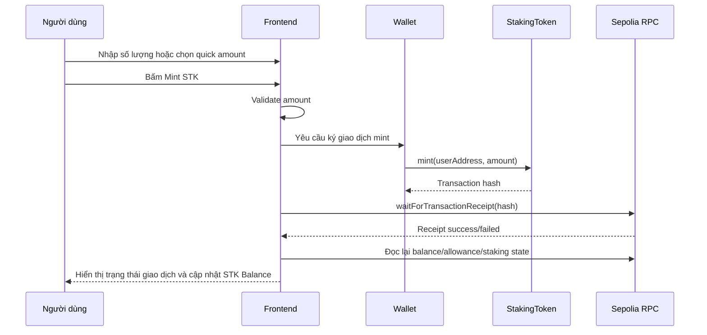
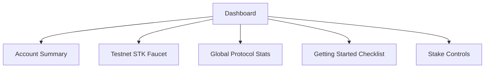
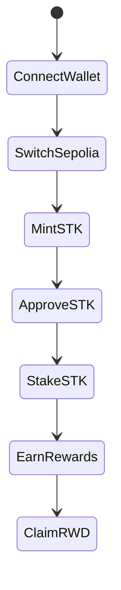
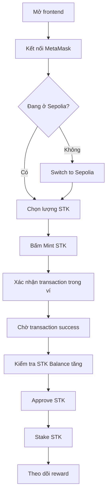

# Báo cáo triển khai Faucet STK và Onboarding Testnet

## 1. Tóm tắt

Phần mở rộng Faucet STK đã được triển khai trực tiếp trên frontend của project `Staking Core` để giúp người dùng mới có thể tự nhận token `STK` testnet và bắt đầu luồng staking mà không cần owner chuyển token thủ công.

Luồng sử dụng thực tế sau khi bổ sung Faucet:

```text
Connect wallet -> Switch Sepolia -> Mint STK -> Approve STK -> Stake STK -> Earn RWD -> Claim RWD
```

Đây là tính năng dành cho môi trường testnet/capstone. Faucet tận dụng contract `MockERC20` đã deploy trên Sepolia, trong đó token `STK` có sẵn hàm `mint(address to, uint256 amount)` public. Vì vậy không cần deploy thêm contract mới.

Kết quả hiện tại:

| Hạng mục | Trạng thái |
|---|---|
| Faucet mint `STK` testnet | Đã triển khai |
| Onboarding checklist | Đã triển khai |
| Tích hợp transaction state hiện có | Đã triển khai |
| Hỗ trợ desktop web | Đã triển khai |
| Hỗ trợ mobile web responsive | Đã triển khai |
| Build frontend | Đã chạy thành công |
| Audit frontend | `0 vulnerabilities` ở mức moderate |
| Kiểm tra dev server | HTTP 200 |
| Kiểm tra thực tế từ người dùng | Đã test OK |

## 2. Bối cảnh triển khai

Ứng dụng staking đã có đầy đủ phần contract và frontend để người dùng stake `STK`, nhận reward `RWD`, xem dashboard, quản lý reward pool và thao tác admin. Tuy nhiên khi dùng với ví Sepolia mới, người dùng thường chưa có token `STK`.

Nếu không có Faucet, luồng thử nghiệm sẽ phụ thuộc vào owner/deployer chuyển `STK` thủ công cho từng ví. Điều này làm trải nghiệm kém thực tế, nhất là khi muốn kiểm thử nhiều ví hoặc hướng dẫn người dùng mới thao tác end-to-end.

Faucet giải quyết điểm nghẽn này bằng cách cho ví đang kết nối tự mint `STK` testnet ngay trên giao diện.

## 3. Cơ sở contract thực tế

Token staking trên Sepolia là `MockERC20`, không phải token production. Contract mock này có hàm mint public:

```solidity
function mint(address to, uint256 amount) external {
    _mint(to, amount);
}
```

Đặc điểm quan trọng:

| Nội dung | Giá trị thực tế |
|---|---|
| Token được faucet mint | `StakingToken` / `STK` |
| Contract token | `MockERC20` |
| Hàm dùng để mint | `mint(address to, uint256 amount)` |
| Quyền gọi hàm mint | Public, không giới hạn owner |
| Cần deploy contract mới | Không |
| Phù hợp production | Không |

Faucet chỉ áp dụng cho `STK`, vì đây là token người dùng cần có để approve và stake. Token `RWD` không được đưa vào faucet cho user, vì `RWD` là reward token và reward pool vẫn nên do owner quản lý thông qua Admin panel.

## 4. Địa chỉ Sepolia đang sử dụng

Các địa chỉ được dùng trong frontend là các contract đã deploy trên Sepolia:

| Contract | Địa chỉ |
|---|---|
| `StakingRewards` | `0x8B30864bEF5B75C39D19Af249D6bbC4210B55963` |
| `StakingToken` / `STK` | `0x69F9e365D78dCB684DDe29ea6A05854273917db8` |
| `RewardsToken` / `RWD` | `0x20bF1B78E8B13B3273a27979725Faf1B74902e07` |
| Owner/deployer | `0xBdE29b2fe1B0CD9b0d134D2690D14f787Fc8A985` |

Thông tin triển khai gốc được lưu trong:

```text
deployed-addresses.txt
```

## 5. Các file đã cập nhật

Tính năng Faucet và onboarding được triển khai trong frontend:

```text
frontend/
  src/
    App.tsx
    config/
      abis.ts
    styles.css
```

Chi tiết thay đổi:

| File | Nội dung triển khai |
|---|---|
| `frontend/src/config/abis.ts` | Bổ sung ABI cho hàm `mint(address,uint256)` của ERC20 mock. |
| `frontend/src/App.tsx` | Bổ sung state Faucet, validate amount, handler mint, Faucet card và onboarding checklist. |
| `frontend/src/styles.css` | Bổ sung style cho Faucet card, quick amount buttons, warning text và onboarding checklist. |

## 6. Bổ sung ABI cho Faucet

Frontend đang dùng `viem` để đọc và ghi contract. Để gọi được hàm mint của `MockERC20`, ABI ERC20 trong `frontend/src/config/abis.ts` đã được bổ sung entry:

```text
mint(address to, uint256 amount)
```

Hàm này có:

| Thuộc tính | Giá trị |
|---|---|
| `type` | `function` |
| `name` | `mint` |
| `stateMutability` | `nonpayable` |
| Input 1 | `to: address` |
| Input 2 | `amount: uint256` |
| Output | Không có |

Nhờ vậy, frontend có thể gọi trực tiếp:

```text
StakingToken.mint(connectedWalletAddress, faucetAmountWei)
```

## 7. Luồng kỹ thuật của Faucet

Faucet dùng ví đang kết nối làm địa chỉ nhận token. Người dùng không cần nhập địa chỉ thủ công, giúp tránh lỗi gửi token nhầm ví.

Luồng xử lý:



Handler mint trong frontend dùng chung cơ chế transaction hiện có. Vì vậy Faucet cũng có các trạng thái:

| Trạng thái | Ý nghĩa |
|---|---|
| `wallet` | Đang chờ người dùng xác nhận trong ví. |
| `confirming` | Transaction đã gửi và đang chờ block xác nhận. |
| `success` | Transaction thành công, dữ liệu được load lại. |
| `failed` | Transaction lỗi hoặc người dùng từ chối ký. |

## 8. Validate số lượng Faucet

Frontend có state riêng cho số lượng Faucet:

```text
faucetAmount
```

Giá trị mặc định:

```text
1000 STK
```

Các mức chọn nhanh:

| Quick amount | Mục đích |
|---|---|
| `100 STK` | Thử nhanh với số lượng nhỏ. |
| `500 STK` | Mức trung bình để test nhiều thao tác. |
| `1000 STK` | Mức mặc định cho onboarding. |

Giới hạn UI:

```text
10,000 STK / transaction
```

Button `Mint STK` sẽ bị disable khi:

| Điều kiện | Lý do |
|---|---|
| Chưa kết nối ví | Không có địa chỉ nhận token. |
| Transaction đang chạy | Tránh gửi nhiều transaction cùng lúc. |
| Amount không parse được | Giá trị nhập không hợp lệ. |
| Amount nhỏ hơn hoặc bằng 0 | Không có ý nghĩa mint. |
| Amount lớn hơn `10,000 STK` | Vượt giới hạn UI đã đặt. |

Nếu số lượng vượt `10,000 STK`, giao diện hiển thị cảnh báo:

```text
Enter 10,000 STK or less.
```

Lưu ý: giới hạn `10,000 STK` là giới hạn phía frontend để trải nghiệm hợp lý hơn. Contract mock hiện tại vẫn là public mint và không có hard cap on-chain.

## 9. Vị trí Faucet trên giao diện

Faucet được đặt trong màn `Dashboard`, ở cột nội dung chính cùng với protocol stats và onboarding checklist.

Cấu trúc dashboard sau khi bổ sung:



Lý do đặt Faucet ở Dashboard:

| Lý do | Giải thích |
|---|---|
| Dễ tìm | Người dùng thấy ngay sau khi vào app. |
| Gần STK Balance | Sau khi mint, có thể quan sát balance cập nhật. |
| Gần Stake Controls | Sau khi có STK, người dùng có thể approve/stake ngay. |
| Phù hợp onboarding | Dashboard là nơi bắt đầu luồng sử dụng chính. |

## 10. Onboarding checklist

Ngoài Faucet, frontend đã bổ sung panel `Getting Started` để hướng dẫn người dùng đi qua luồng testnet theo từng bước.

Các bước trong checklist:

| Bước | Điều kiện hoàn thành thực tế |
|---|---|
| Connect wallet | `address !== undefined` |
| Switch to Sepolia | `chainId === 11155111` |
| Mint STK | `reads.stakingTokenBalance > 0` |
| Approve STK | `reads.allowance > 0` |
| Stake STK | `reads.stakedBalance > 0` |
| Earn rewards | `reads.earnedReward > 0` hoặc vừa claim RWD thành công |

Checklist có ba trạng thái trực quan:

| Trạng thái | Cách hiểu |
|---|---|
| Done | Bước đã hoàn thành, hiển thị icon check. |
| Current | Bước hiện tại người dùng nên làm tiếp. |
| Pending | Bước phía sau, chờ các bước trước hoàn thành. |

Luồng onboarding tổng quát:



## 11. Tích hợp với dữ liệu on-chain

Faucet không dùng dữ liệu giả. Sau khi transaction thành công, frontend gọi lại `loadState()` để đọc dữ liệu mới từ Sepolia.

Các dữ liệu liên quan được refresh:

| Dữ liệu | Nguồn đọc |
|---|---|
| `stakingTokenBalance` | `STK.balanceOf(userAddress)` |
| `allowance` | `STK.allowance(userAddress, StakingRewards)` |
| `stakedBalance` | `StakingRewards.stakedBalance(userAddress)` |
| `earnedReward` | `StakingRewards.earned(userAddress)` |
| `totalStaked` | `StakingRewards.totalStaked()` |
| `contractStakeBalance` | `STK.balanceOf(StakingRewards)` |
| `contractRewardBalance` | `RWD.balanceOf(StakingRewards)` |

Ngoài refresh sau transaction, frontend cũng có polling mỗi 10 giây khi ví đã kết nối đúng Sepolia.

## 12. Hỗ trợ responsive/mobile

Faucet và checklist được viết bằng layout CSS responsive sẵn có của frontend. Trên mobile web:

| Thành phần | Hành vi |
|---|---|
| Faucet card | Xếp dọc, input và button chiếm chiều ngang phù hợp. |
| Quick buttons | Giữ dạng 3 cột nhỏ, dễ chọn nhanh. |
| Checklist | Mỗi bước là một row riêng, không bị tràn chữ. |
| Navigation | Dùng bottom navigation hiện có cho Dashboard/Rewards/Admin. |
| Nội dung Dashboard | Xếp dọc để thao tác tốt trên màn hình nhỏ. |

Đây vẫn là mobile web responsive, không phải ứng dụng native iOS/Android.

## 13. Quy trình test thủ công

Quy trình kiểm thử thực tế cho một ví mới:



Các state lỗi có thể kiểm tra:

| Trường hợp | Cách test | Kết quả mong đợi |
|---|---|---|
| Chưa kết nối ví | Mở app khi chưa connect wallet | Faucet không thể mint vì không có địa chỉ ví. |
| Sai network | Kết nối ví ở network khác Sepolia | App yêu cầu chuyển sang Sepolia trước khi thao tác đúng luồng. |
| Từ chối transaction | Bấm `Mint STK`, sau đó reject trong ví | Transaction state chuyển sang failed/error. |
| Amount quá lớn | Nhập số lớn hơn `10000` | Hiện warning và disable button mint. |
| Amount không hợp lệ | Nhập text hoặc số không parse được | Disable button mint. |
| Thiếu Sepolia ETH | Gửi transaction khi ví không đủ gas | Wallet/RPC báo lỗi, frontend hiển thị failed state. |

## 14. Kết quả kiểm tra kỹ thuật

Các kiểm tra đã được chạy sau khi triển khai:

| Kiểm tra | Kết quả |
|---|---|
| `npm run build` trong `frontend/` | Thành công |
| TypeScript check qua script build | Thành công |
| Vite production build | Thành công |
| `npm audit --audit-level=moderate` trong `frontend/` | `found 0 vulnerabilities` |
| HTTP check `http://127.0.0.1:5173/` | `200 OK` |
| HTTP check `http://127.0.0.1:5173/?preview=tx-error` | `200 OK` |
| Test thủ công bởi người dùng | OK |

Thông tin build frontend ghi nhận:

```text
dist/index.html
dist/assets/*.css
dist/assets/*.js
```

Frontend dev server đang chạy local:

```text
http://127.0.0.1:5173/
```

## 15. Giới hạn và lưu ý bảo mật

Faucet hiện tại phù hợp cho capstone/testnet, nhưng không phù hợp production.

Các giới hạn cần ghi nhớ:

| Giới hạn | Giải thích |
|---|---|
| Public mint | Bất kỳ ví nào cũng có thể gọi `mint` trên `MockERC20`. |
| Giới hạn 10,000 STK chỉ ở UI | Contract không enforce giới hạn này on-chain. |
| Token không có giá trị thật | `STK` faucet là token testnet/mock. |
| Vẫn cần Sepolia ETH | Người dùng phải có ETH testnet để trả gas. |
| Không faucet `RWD` | Reward token vẫn do owner quản lý qua Admin panel. |

Nếu muốn biến Faucet thành mô hình nghiêm túc hơn, nên triển khai contract Faucet riêng có các rule on-chain như:

| Hướng cải tiến | Lợi ích |
|---|---|
| Cooldown theo ví | Tránh mint liên tục. |
| Giới hạn amount on-chain | Không phụ thuộc vào frontend. |
| Faucet balance riêng | Không để token mock mint vô hạn. |
| Event riêng cho faucet | Dễ thống kê lượt nhận token. |
| CAPTCHA hoặc allowlist | Giảm spam ở môi trường public. |

## 16. Đánh giá tác động

Faucet STK làm project thực tế và dễ dùng hơn ở các điểm:

| Trước khi có Faucet | Sau khi có Faucet |
|---|---|
| Ví mới không có `STK` để stake. | Ví mới có thể tự mint `STK` testnet. |
| Cần owner chuyển token thủ công. | Không cần thao tác thủ công từ owner. |
| Luồng test bị ngắt ở bước chuẩn bị token. | Có thể chạy end-to-end ngay trên UI. |
| Người dùng phải hiểu trước cần token gì. | Checklist chỉ rõ từng bước cần làm. |
| Khó test nhiều ví. | Test nhiều ví nhanh hơn. |

Sau khi triển khai, ứng dụng đã có luồng onboarding hoàn chỉnh cho người dùng testnet:

```text
Connect wallet
Switch to Sepolia
Mint STK
Approve STK
Stake STK
Earn rewards
Claim RWD
```

## 17. Kết luận

Tính năng Faucet STK đã được triển khai đúng với môi trường thực tế của project: sử dụng `MockERC20` đã deploy trên Sepolia, không deploy thêm contract, không thay đổi logic staking cốt lõi, và tích hợp vào frontend hiện có bằng `viem`.

Faucet giúp ứng dụng staking có tính ứng dụng hơn vì người dùng mới có thể tự chuẩn bị `STK` testnet để thao tác ngay. Onboarding checklist giúp luồng thử nghiệm rõ ràng, trực quan và phù hợp với cả desktop web lẫn mobile web.

Trạng thái hiện tại: tính năng đã build thành công, audit frontend sạch ở mức moderate, dev server trả HTTP 200, và người dùng đã kiểm thử thực tế thành công.
